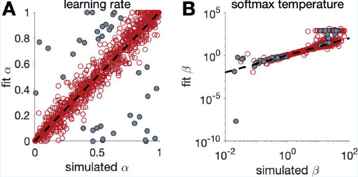
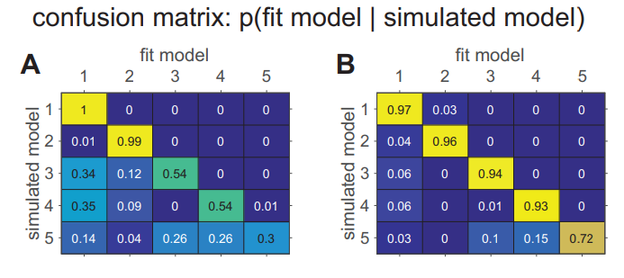

# binaryRL
This package is designed to simplify the process of building **model-free** reinforcement learning models. It allows beginners to easily construct a model with just an `if-else` statement, making model creation more accessible.

Before using this package, please make sure you agree with this assumptions.

> This experiment employs a Two-Alternative Forced Choice (TAFC) paradigm. Learning for each stimulus is independent, meaning reward outcomes for one stimulus do not affect learning for other stimuli.

If you agree with this assumptions, I will introduce how to use this package.

<!---------------------------------------------------------->

# How to cite 
Hu, M., & L, Z. (2025). binaryRL: A Package for Building Reinforcement Learning Models in R. *Journal*(7), 100-123. https://doi.org/


# Tutorial
## Install and Load Pacakge
```r
devtools::install_github("yuki-961004/binaryRL") 
library(binaryRL)
```
```
                                     +------------------------+
   ___                               |  +---------+           |
  |  _ \                             |  |  RRRR   |   L       |
  | |_) (_)_ __   __ _ _ __ _   _    |  |  R   R  |   L       |
  |  _ \| | '_ \ / _` | '__| | | |   |  |  RRRR   |   L       |
  | |_) | | | | | (_| | |  | |_| |   |  |  R R    |   L       |
  |____/|_|_| |_|\__,_|_|   \__, |   |  |  R  RR  |   LLLLLL  |
                            |___/    |  +---------+           |
                                     +------------------------+  
```


<!---------------------------------------------------------->

## Read your Raw Data
```r
# An open data from Ludvig et. al. (2014) https://osf.io/eagcd/
head(Ludvig_2014_Exp1)
```

| Subject | Block | Trial | L_choice | R_choice | L_reward | R_reward | Sub_Choose |
|---------|-------|-------|----------|----------|----------|----------|------------|
| 1       | 1     | 1     | A        | B        | 20       | 0        | A          |
| 1       | 1     | 2     | B        | A        | 40       | 20       | B          |
| 1       | 1     | 3     | C        | D        | -20      | 0        | C          |
| 1       | 1     | 4     | D        | C        | -40      | -20      | D          |
| ...     | ...   | ...   | ...      | ...      | ...      | ...      | ...        |

*NOTES*

1. Your dataset needs to include these **columns**.   
2. You can also add two **additional variables** as factors that the model needs to consider.

### References
Ludvig, E. A., Madan, C. R., & Spetch, M. L. (2014). Extreme outcomes sway risky decisions from experience. Journal of Behavioral Decision Making, 27(2), 146-156. https://doi.org/10.1002/bdm.1792

<!---------------------------------------------------------->

## 1. Run Model

Create a model function that contains only ONE argument: `params`.   

```r
model <- function(params){
  # since `obj_func`(model) can only be one argument, `params`, 
  # `fit_p` will pass the fit_data into global environment, then delete it.
  data <- get(x = "fit_data", envir = globalenv()) 

  # build a RL model
  res <- binaryRL::run_m(
    data = data,                    # your data
    id = 1,                         # Subject ID
    eta = c(params[1], params[2]),  # free parameters (RSTD)
    n_params = 2,                   # the number of free parameters
    n_trials = 288                  # the number of total trials
  )

  # pass the result to the parent environment
  # make it easier to get the optimal parameters later
  assign("binaryRL_res", res, envir = parent.frame())
  
  # if the algorithm is solving a minimization problem, return -ll
  return(-res$ll) # L-BFGS-B, GenSA, DEoptim Bayesian ...
  # if the algorithm is solving a maximization problem, return ll
  # return(res$ll) # GA ...
}
```

<!---------------------------------------------------------->

<details>
<summary>Custom Column Names</summary>

```r
model <- function(params){
  data <- get(x = "fit_data", envir = globalenv()) 

  res <- binaryRL::run_m(
    data = data,                    
    id = 1,                         
    eta = c(params[1], params[2]),  
    n_params = 2,                   
    n_trials = 288,                 

    # column names
    sub = "Subject",
    time_line = c("Block", "Trial"),
    L_choice = "L_choice",
    R_choice = "R_choice",
    L_reward = "L_reward",
    R_reward = "R_reward",
    sub_choose = "Sub_Choose",
    rob_choose = "Rob_Choose",
    raw_cols = c(
      "Subject", "Block", "Trial",
      "L_choice", "R_choice", "L_reward", "R_reward",
      "Sub_Choose"
    ),
    var1 = "extra_Var1",
    var2 = "extra_Var2"
  )

  assign("binaryRL_res", res, envir = parent.frame())
  
  return(-res$ll) 
  # return(res$ll) 
}
```

</details>  

<!---------------------------------------------------------->

If your column names are different from my example, you need to fill in the column names in the argument of `binaryRL::run_m`

<!---------------------------------------------------------->

<details>
<summary>Custom Functions</summary>

```r
model <- function(params){
  data <- get(x = "fit_data", envir = globalenv()) 

  # build a RL model
  res <- binaryRL::run_m(
    data = data,                    
    id = 1,                         
    eta = c(params[1], params[2]),  
    n_params = 2,                   
    n_trials = 288,                 

    # functions
    util_func = your_util_func,
    rate_func = your_rate_func,  
    expl_func = your_expl_func,
    prob_func = your_prob_func
  )

  assign("binaryRL_res", res, envir = parent.frame())
  
  return(-res$ll) 
  # return(res$ll) 
}
```

</details>  

<!---------------------------------------------------------->

You can also customize the `value function` and `action function`. The default function is applicable to three basic models. 

<!---------------------------------------------------------->

The following are the four basic functions used by default in the program. You can customize them based on this

<!---------------------------------------------------------->

<details>
<summary>Utility Function (γ)</summary>

```r
print(binaryRL::func_gamma)
```

```r
func_gamma <- function(
  # variables
  value, utility, reward, occurrence, var1, var2, 
  # parameters
  gamma, lambda
){
  if (length(gamma) == 1) {
    gamma <- gamma
    utility <- sign(reward) * (abs(reward) ^ gamma)
  }
  else {
    utility <- "ERROR" 
  }
  return(list(gamma, utility))
}
```
</details>

<!---------------------------------------------------------->

<details>
<summary>Learning Rate Function (η)</summary>

```r
print(binaryRL::func_eta)
```

```r
func_eta <- function (
  # variables
  value, utility, reward, occurrence, var1, var2, 
  # parameters
  eta, lambda
){
  if (length(eta) == 1) {
    eta <- as.numeric(eta)
  }
  else if (length(eta) > 1 & utility <  value) {
    eta <- eta[1]
  }
  else if (length(eta) > 1 & utility >= value) {
    eta <- eta[2]
  }
  else {
    eta <- "ERROR" 
  }
    return(eta)
}
```
</details>

<!---------------------------------------------------------->

<details>
<summary>Exploration Function (ε)</summary>

```r
print(binaryRL::func_epsilon)
```

```r
func_epsilon <- function(
  # variables
  i, var1, var2, 
  # parameters
  threshold, epsilon, lambda
){
  if (i <= threshold) {
    try <- 1
  } 
  else if (i > threshold & is.na(epsilon)) {
    try <- 0
  } 
  else if (i > threshold & !(is.na(epsilon))){
    try <- sample(
      c(1, 0),
      prob = c(epsilon, 1 - epsilon),
      size = 1
    )
  }
  else {
    try <- "ERROR"
  }
  return(try)
}
```
</details>

<!---------------------------------------------------------->

<details>
<summary>Soft-Max Function (τ)</summary>

```r
print(binaryRL::func_tau)
```

```r
func_tau <- function (
  # variables
  LR, try, L_value, R_value, var1, var2, 
  # parameters
  tau, lambda 
){
  if (!(LR %in% c("L", "R"))) {
    stop("LR = 'L' or 'R'")
  }
  else if (try == 0 & LR == "L") {
    prob <- 1 / (1 + exp(-(L_value - R_value) * tau))
  }
  else if (try == 0 & LR == "R") {
    prob <- 1 / (1 + exp(-(R_value - L_value) * tau))
  }
  else if (try == 1) {
    prob <- 0.5
  } 
  else {
    prob <- "ERROR"
  } 
  return(prob)
}
```

</details>

<!---------------------------------------------------------->

## 2. Fit Parameters

This package includes **5** algorithms:   
1. L-BFGS-B (from `stats::optim`)  
2. Simulated Annealing (`GenSA::GenSA`)  
3. Genetic Algorithm (`GA::ga`)  
4. Differential Evolution (`DEoptim::DEoptim`).   
5. Bayesian Optimization (`mlrMBO::mbo`)
6. Particle Swarm Optimization (`pso::psoptim`)
7. Covariance Matrix Adapting Evolutionary Strategy (`cmaes::cma_es`)

> Please let me know if you know any other great algorithm package. I'd be happy to incorporate them into this package. 

<!---------------------------------------------------------->

```r
binaryRL_res <- binaryRL::fit_p(
  data = Ludvig_2014_Exp1,
  obj_func = model,
  lower = c(0, 0),
  upper = c(1, 1),
  iteration = 10,
  seed = 123,
  algorithm = "PSO"        # Particle Swarm Optimization (pso::psoptim)
  #algorithm = "DEoptim"   # Differential Evolution (DEoptim::DEoptim)
  #algorithm = "Bayesian"  # Bayesian Optimization (mlrMBO::mbo)
  #algorithm = "L-BFGS-B"  # Gradient-Based (stats::optim)
  #algorithm = "GenSA"     # Simulated Annealing (GenSA::GenSA)
  #algorithm = "CMA-ES"    # Covariance Matrix Adapting (`cmaes::cma_es`)
  #algorithm = "GA"        # Genetic Algorithm (GA::ga)
)
```

```r
#> Results of the Reinforcement Learning Model:
#> 
#> Parameters:
#>    λ:  NA  
#>    γ:  1 
#>    η:  0.128 0.081 
#>    ε:  NA 
#>    τ:  1

#> Model Fit:
#>    Accuracy:  76.74 %
#>    LogL:  -597.92 
#>    AIC:  1199.84 
#>    BIC:  1207.17 
```

<!---------------------------------------------------------->
## How to run Classic Models

The default function can run the three classic models here. Setting different parameters in `run_m` means running different RL models.

<!---------------------------------------------------------->

### 1. TD Model ($\eta$)

> "The TD model is a standard temporal difference learning model (Barto, 1995; Sutton, 1988; Sutton and Barto, 1998)."  

**if only ONE $\eta$ is set as a free paramters, it represents the TD model.**

```r
# TD Model
binaryRL::run_m(
  ...,
  eta = c(params[1]),              # free parameter: learning rate
  gamma = 1,                       # fixed parameter: utility, default as 1
  n_params = 1,                    # the number of free parameters
  ...
)
```

### 2. Risk-Sensitive TD Model ($\eta_{-}$, $\eta_{+}$)

> "In the risk-sensitive TD (RSTD) model, positive and negative prediction errors have asymmetric effects on learning (Mihatsch and Neuneier, 2002)."  

**If TWO $\eta$ are set as free parameters, it represents the RSTD model.**

```r
# RSTD Model
binaryRL::run_m(
  ...,
  eta = c(params[1], params[2]),   # free parameter: learning rate
  gamma = 1,                       # fixed parameter: utility, default as 1
  n_params = 2,                    # the number of free parameters
  ...
)
```

### 3. Utility Model ($\eta$, $\gamma$)

> "The utility model is a TD learning model that incorporates nonlinear subjective utilities (Bernoulli, 1954)"

**If ONE $\eta$ and ONE $\gamma$ are set as free parameters, it represents the utility model.**

```r
# Utility Model
binaryRL::run_m(
  ...,
  eta = c(params[1]),              # free parameter: learning rate
  gamma = c(params[2]),            # free parameter: utility
  n_params = 2,                    # the number of free parameters
  ...
)
```

<p align="center">
    
</p>

### References
Niv, Y., Edlund, J. A., Dayan, P., & O'Doherty, J. P. (2012). Neural prediction errors reveal a risk-sensitive reinforcement-learning process in the human brain. *Journal of Neuroscience, 32*(2), 551-562. https://doi.org/10.1523/JNEUROSCI.5498-10.2012

<!---------------------------------------------------------->

## 3. Simulate List

Use your `obj_func` and set its `back = TRUE`. This will allow you to obtain a series of fake datasets (`list_simulated`) generated by random parameters. 

```r
RSTD <- function(params){
  data <- Ludvig_2014_Exp1
  
  res <- binaryRL::run_m(
    back = TRUE,                    # simulate raw data
    data = data,                    # your data
    id = 1,                         # Subject ID
    eta = c(params[1], params[2]),  # free parameters (RSTD)
    n_params = 2,                   # the number of free parameters
    n_trials = 288                  # the number of total trials
  )

  return(res)
}

list_simulated <- binaryRL::simulate_l(
  obj_func = RSTD,
  n_params = 2, 
  lower = c(0, 0),
  upper = c(1, 1),
  seed = 123,
  iteration = 10
)
```

```
list_simulated
├── [[1]]       |   [binaryRL] iteration = 1 
│   ├── data    |     | [data.frame] simulated raw data
│   ├── params  |     | [list] all parameters' value
│   ├── acc     |     | [vector] accuracy with input params
│   ├── ll      |     | [vector] logL with input params
│   ├── aic     |     | [vector] AIC with input params
│   ├── bic     |     | [vector] BIC with input params
│   ├── input   |     | [vector] input params
├── [[2]]       |   [binaryRL] iteration = 2 
├── [[3]]       |   [binaryRL] iteration = 3 
├── [[...]]     |   [binaryRL] iteration = ... 
```

## 4. Recovery Data
If the simulated and fitted models are the same, then parameter recovery is being performed.  
If the simulated model is A, and the fitted model is any of the alternative models, then model recovery is being performed.  
Here, I will only show the process of performing parameter recovery using the RSTD model.
<!---------------------------------------------------------->

```r
TD <- function(params){
  data <- get(x = "fit_data", envir = globalenv()) 
  
  res <- binaryRL::run_m(
    data = data,                    # your data
    id = 1,                         # Subject ID
    eta = c(params[1]),             # free parameters (TD)
    n_params = 1,                   # the number of free parameters
    n_trials = 288                  # the number of total trials
  )

  assign("binaryRL_res", res, envir = parent.frame())
  
  invisible(-res$ll)
}

df_recovery <- binaryRL::recovery_d(
  list = list_simulated,
  obj_func = TD,
  model_name = "TD",
  lower = c(0),
  upper = c(1),
  iteration = 3,
  seed = 123,
  algorithm = "Bayesian"
)
```

| model | ACC   | LL      | AIC    | BIC    | input_param_1 | input_param_2 | output_param_1 | output_param_2 |
|-------|-------|---------|--------|--------|---------------|---------------|----------------|----------------|
| RSTD  | 90.62 | -282.94 | 569.88 | 577.21 | 0.64          | 0.29          | 0.59           | 0.21           |
| RSTD  | 95.49 | -189.03 | 382.06 | 389.39 | 0.72          | 0.13          | 0.71           | 0.10           |
| RSTD  | 94.79 | -216.34 | 436.68 | 444.01 | 0.95          | 0.21          | 0.59           | 0.21           |
| RSTD  | 90.28 | -165.03 | 334.06 | 341.39 | 0.68          | 0.54          | 0.51           | 0.32           |
| RSTD  | 92.01 | -209.80 | 423.60 | 430.93 | 0.20          | 0.33          | 0.17           | 0.24           |
| RSTD  | 93.06 | -68.39  | 140.78 | 148.11 | 0.32          | 0.65          | 0.23           | 0.26           |
| RSTD  | 90.28 | -165.03 | 334.06 | 341.39 | 0.57          | 0.53          | 0.51           | 0.32           |
| RSTD  | 90.28 | -165.03 | 334.06 | 341.39 | 0.97          | 0.70          | 0.51           | 0.32           |
| RSTD  | 90.28 | -165.03 | 334.06 | 341.39 | 0.90          | 0.94          | 0.51           | 0.32           |
| RSTD  | 99.65 | -17.41  | 38.82  | 46.15  | 0.05          | 0.75          | 0.14           | 0.44           |

<!---------------------------------------------------------->

### Parameter Recovery
> "Before reading too much into the best-fitting parameter values, $\theta_{m}^{MLE}$,  it is important to check whether the fitting procedure gives meaningful parameter values in the best case scenario, -that is, when fitting fake data where the ‘true’ parameter values are known (Nilsson et al., 2011). Such a procedure is known as ‘Parameter Recovery’, and is a crucial part of any model-based analysis."

<p align="center">
    
</p>

### Model Recovery
> "More specifically, model recovery involves simulating data from all models (with a range of parameter values carefully selected as in the case of parameter recovery) and then fitting that data with all models to determine the extent to which fake data generated from model A is best fit by model A as opposed to model B. This process can be summarized in a confusion matrix that quantifies the probability that each model is the best fit to data generated from the other models, that is, *p*(*fit model* = B | *simulated model* = A)."

<p align="center">
    
</p>

### References  
Wilson, R. C., & Collins, A. G. (2019). Ten simple rules for the computational modeling of behavioral data. *Elife*, 8, e49547. https://doi.org/10.7554/eLife.49547

<!---------------------------------------------------------->

---

# Other Arguments
## Initial Value
In `run_m`, there is an argument called `initial_value`. Considering that the initial value has a significant impact on the parameter estimation of the **learning rates ($\eta$)** When the initial value is not set (`initial_value = NA`), it is taken to be the reward received for that stimulus the first time.

> "Comparisons between the two learning rates generally revealed a positivity bias ($\alpha_{+} > \alpha_{-}$)"  
> "However, that on some occasions, studies failed to find a positivity bias or even reported a negativity bias ($\alpha_{+} < \alpha_{-}$)."  
> "Because Q-values initialization markedly affect learning rate and learning bias estimates."

```r
binaryRL::run_m(
  ...,
  initial_value = NA,
  ...
)
```

### References
Palminteri, S., & Lebreton, M. (2022). The computational roots of positivity and confirmation biases in reinforcement learning. *Trends in Cognitive Sciences, 26*(7), 607-621. https://doi.org/10.1016/j.tics.2022.04.005

<!---------------------------------------------------------->
## Utility Function
The subjective value of objective rewards is a topic that requires discussion, as different scholars may have different perspectives. This can be traced back to the `Weber-Fechner Law`. In this model, you can customize your utility function. By default, I believe there is a linear relationship between subjective value and objective value.

$$
U(R) = \gamma \cdot R
\quad | \quad
U(R) = \gamma \cdot R^2
\quad | \quad
U(R) = R ^ \gamma
\quad | \quad
U(R) = log_\gamma R
$$

```r
func_gamma <- function(
  value, utility, reward, occurrence, var1, var2, gamma, lambda
){
  if (length(gamma) == 1) {
    gamma <- gamma
    utility <- reward * gamma
    # Custom your utility function
    # utility <- (reward ^ 2) * gamma
    # utility <- reward ^ gamma
    # utility <- log(reward, base = gamma)
    # ...
  }
  else {
    utility <- "ERROR" 
  }
  return(list(gamma, utility))
}
```

<!---------------------------------------------------------->

## $\epsilon$-Greedy
Participants in the experiment may not always choose based on the value of the options, but instead select randomly on some trials. This is known as $\epsilon$-greedy. (e.g., when epsilon = 0.1 (*default: NA*), it means that the participant has a 10% probability of randomly selecting an option and a 90% probability of choosing based on the currently learned value of the options.)

- In my opinion, I think that participants tend to randomly select options during the early stages of the experiment to estimate the value of each option. Therefore, I added an argument called `threshold`, which specifies the number of trials during which participants will make completely random choices. The default value is set to 1.

```r
binaryRL::run_m(
  ...,
  threshold = 20,      
  epsilon = 0.1,
  ...
)
```

### References
Ganger, M., Duryea, E., & Hu, W. (2016). Double Sarsa and double expected Sarsa with shallow and deep learning. Journal of Data Analysis and Information Processing, 4(04), 159. https://doi.org/10.4236/jdaip.2016.44014

<!---------------------------------------------------------->

## Soft-Max Function
The closer $\tau$ is to 1 (*default: 0.5*), the more sensitive the subjects become to the values of the left and right options. In other words, even a slight difference in value will lead the subjects to choose the option with the higher value.  

If you add $\tau$ to your model as a extra free parameter, you will generally achieve better model fit. In fact, some articles have already incorporated the parameter in the softmax function into reinforcement learning models (e.g., Niv et al., 2012; Rosenbaum et al.,2022).

```r
# RSTD Model
binaryRL::run_m(
  ...,
  eta = c(params[1], params[2]),   # free parameter: learning rate
  gamma = 1,                       # fixed parameter: utility, default as 1
  tau = c(params[3]),              # free paramters: sensitivity to value differences
  n_params = 3,                    # the number of free parameters
  ...
)
```

### References
Niv, Y., Edlund, J. A., Dayan, P., & O'Doherty, J. P. (2012). Neural prediction errors reveal a risk-sensitive reinforcement-learning process in the human brain. *Journal of Neuroscience, 32*(2), 551-562. https://doi.org/10.1523/JNEUROSCI.5498-10.2012  
Rosenbaum, G. M., Grassie, H. L., & Hartley, C. A. (2022). Valence biases in reinforcement learning shift across adolescence and modulate subsequent memory. *ELife, 11*, e64620. https://doi.org/10.7554/eLife.64620

<!---------------------------------------------------------->

## Model Fit

LL represents the similarity between the model's choices and human choices. The larger this value, the better the model.

$$
LL = \sum B_{L} \times \log P_{L} + \sum B_{R} \times \log P_{R}
$$   

$$
AIC =  - 2 LL + 2 k
$$

$$
BIC =  - 2 LL + k \times \log n
$$ 

*NOTE:* ${k}$ the number of free parameters in the model; ${n}$ represents the total number of trials in the paradigm.

### References
Hampton, A. N., Bossaerts, P., & O'doherty, J. P. (2006). The role of the ventromedial prefrontal cortex in abstract state-based inference during decision making in humans. *Journal of Neuroscience, 26*(32), 8360-8367. https://doi.org/10.1523/JNEUROSCI.1010-06.2006


---

<!---------------------------------------------------------->

# Functions

<!---------------------------------------------------------->

## Value Function

**Value Function** independently updating the value associated with each stimulus.

- **Utility Function ($\gamma$)**: Some also refer to it as the _discount rate_ (for example, in the R package `ReinforcementLearning`), but I believe expressing it as people's subjective perception of objective rewards is more accurate. This is because the relationship between physical quantities and psychological quantities is not necessarily always a linear discount function; it could also be another type of power function relationship (Stevens' Power Law).   
  - If you agree the relationship between objective value and subjective value is linear, represented by the equation:

$$  
U(R) = \gamma \cdot R  
\quad \quad \Rightarrow \quad \quad
V_{n} = V_{n-1} + \eta \cdot (\gamma \cdot R_{n} - V_{n-1})  
$$  

- **Learning Rates ($\eta$)**: This parameter $\eta$ controls how quickly an agent updates its value estimates based on new information. The closer $\eta$ is to 1, the faster the learning rate.

$$  
V_{n} = V_{n-1} + \eta \cdot [U(R_{n}) - V_{n-1}]  
$$  

<!---------------------------------------------------------->

## Action Function
**Action Function** reflecting how individuals make choices based on the value of the options.  

 - **Exploration Function ($\epsilon$)**: The parameter $\epsilon$ represents the probability of participants engaging in exploration (random choosing). In addition A threshold ensures participants always explore during the initial trials, after which the likelihood of exploration is determined by $\epsilon$..   

$$
P(x) =
\begin{cases} 
\epsilon, &  x = 1 \quad \text{(random choosing)} \\
1 - \epsilon, &  x = 0 \quad \text{(value-based choosing)}
\end{cases}
$$

 - **Soft-Max Function ($\tau$)**: The parameter $\tau$ represents people's sensitivity to value differences. The larger $\tau$, the more sensitive they are to the differences in value between the two options.

$$
P_{L} = \frac{1}{1 + e^{-(V_{L} - V_{R}) \cdot \tau}}
\quad \quad
P_{R} = \frac{1}{1 + e^{-(V_{R} - V_{L}) \cdot \tau}}
$$

<!---------------------------------------------------------->

## Loss Function
**Loss Function** quantifies the error between predicted and actual values in a machine learning model. It guides the model's training by indicating how well it's performing.  

- **Log Likelihood Function** representing how similar robot behavior is to human behavior

$$
LL = \sum B_{L} \times \log P_{L} + \sum B_{R} \times \log P_{R}
$$   

*NOTE:* $B_{L}$ and $B_{R}$ the option that the subject chooses. ($B_{L} = 1$: subject chooses the left option; $B_{R} = 1$: subject chooses the right option); $P_{L}$ and $P_{R}$ represent the probabilities of selecting the left or right option, as predicted by the reinforcement learning model.   

<!---------------------------------------------------------->
