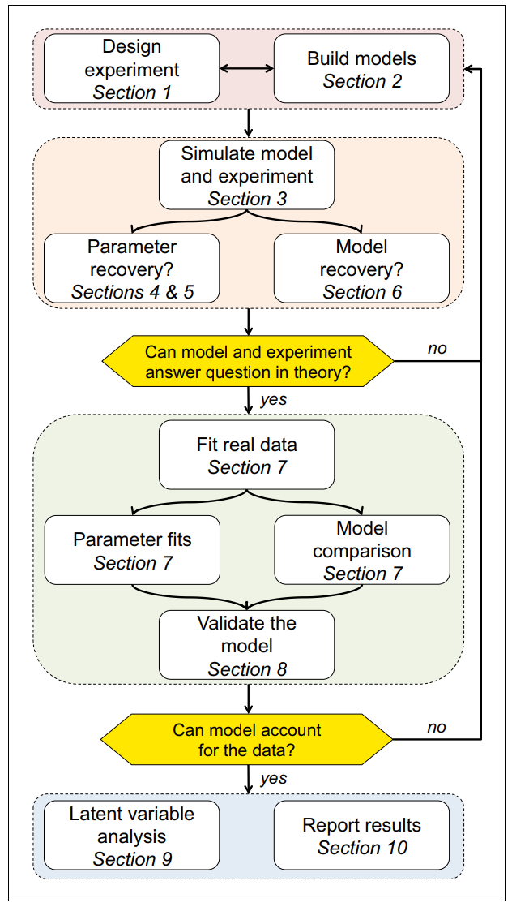
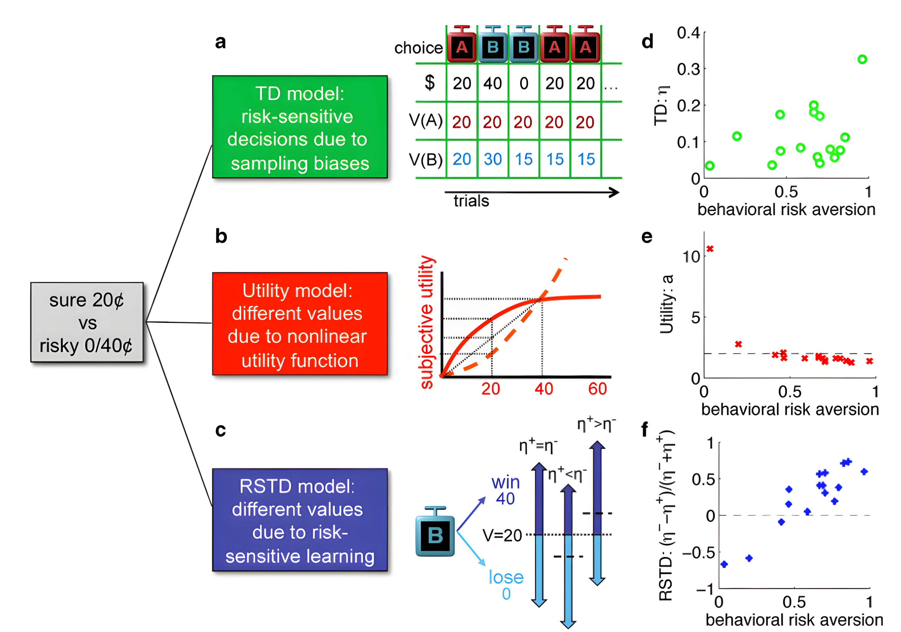

# binaryRL <a href="https://yuki-961004.github.io/binaryRL/"></a>

<!-- badges: start -->

[](https://github.com/yuki-961004/binaryRL/actions/workflows/R-CMD-check.yaml)
[](https://app.codecov.io/gh/yuki-961004/binaryRL)
[](https://CRAN.R-project.org/package=binaryRL)
[](https://CRAN.R-project.org/package=binaryRL)

<!-- badges: end -->

## Overview
This package is designed to help users build the **Rescorla-Wagner Model** for **Two-Alternative Forced Choice** tasks (e.g. multi-armed bandit). Beginners can define models using simple **`if-else`** logic, making model construction more accessible.  

* [Step 1](./articles/binaryRL.html#id_1-run-model): Build Reinforcement Learning Models `run_m()`
* [Step 2](./articles/binaryRL.html#id_2-recovery): Parameter and Model Recovery `rcv_d()`
* [Step 3](./articles/binaryRL.html#id_3-fit-real-data): Fit Real Data `fit_p()`
* [Step 4](./articles/binaryRL.html#id_4-replay-the-experiment): Replay the Experiment `rpl_e()` 

<!---------------------------------------------------------->

## How to cite 
YuKi. (2025). binaryRL: Reinforcement Learning Tools for Two-Alternative Forced Choice Tasks. R package version 0.9.0. https://CRAN.R-project.org/package=binaryRL

Hu, M., & Liu, Z. (2025). binaryRL: A Package for Building Reinforcement Learning Models in R. *Journal(7)*, 100-123. https://doi.org/

## Installation
```r
# Install the stable version from CRAN  
install.packages("binaryRL")
# Install the latest version from GitHub
remotes::install_github("yuki-961004/binaryRL@*release")

# Load package
library(binaryRL)
# Obtain help document
?binaryRL
```

<pre>
                                      ╔═════════════════════════╗
                                      ║ ╔----------╗            ║
                                      ║ | ██████╗  |  ██╗       ║
 |     _)                             ║ | ██╔══██╗ |  ██║       ║
 __ \   |  __ \    _` |   __|  |   |  ║ | ██████╔╝ |  ██║       ║
 |   |  |  |   |  (   |  |     |   |  ║ | ██╔══██╗ |  ██║       ║
_.__/  _| _|  _| \__,_| _|    \__, |  ║ | ██║  ██║ |  ███████╗  ║
                              ____/   ║ | ╚═╝  ╚═╝ |  ╚══════╝  ║
                                      ║ ╚----------╝            ║
                                      ╚═════════════════════════╝
</pre>

<!---------------------------------------------------------->

# Tutorial
*In tasks with small, finite state sets (e.g. TAFC tasks in psychology), all states, actions, and their corresponding rewards could be recorded in tables.*  

- Sutton & Barto [(2018)](https://mitpress.mit.edu/9780262039246/reinforcement-learning/) call this kind of scenario as the **tabular case** and the corresponding methods as **tabular methods**.  
- The development and usage workflow of this R package adheres to the **four** stages (ten rules) recommended by Wilson & Collins [(2019)](https://doi.org/10.7554/eLife.49547).  
- The **three** basic models built into this R package are referenced from Niv et al. [(2012)](https://doi.org/10.1523/JNEUROSCI.5498-10.2012).  
- The **example data** used in this R package is an open data from Mason et. al. [(2024)](https://osf.io/hy3q4/)

<p align="center">
    
    
</p>

**Reference**  

Sutton, R. S., & Barto, A. G. (2018). *Reinforcement Learning: An Introduction* (2nd ed). MIT press.  

Wilson, R. C., & Collins, A. G. (2019). Ten simple rules for the computational modeling of behavioral data. *Elife, 8*, e49547. https://doi.org/10.7554/eLife.49547  

Niv, Y., Edlund, J. A., Dayan, P., & O'Doherty, J. P. (2012). Neural prediction errors reveal a risk-sensitive reinforcement-learning process in the human brain. *Journal of Neuroscience, 32*(2), 551-562. https://doi.org/10.1523/JNEUROSCI.5498-10.2012  

Mason, A., Ludvig, E. A., Spetch, M. L., & Madan, C. R. (2024). Rare and extreme outcomes in risky choice. *Psychonomic Bulletin & Review, 31*(3), 1301-1308. https://doi.org/10.3758/s13423-023-02415-x

<!---------------------------------------------------------->

## [Example Data](./demo/DATA/binaryRL_data.html)

```r
head(binaryRL::Mason_2024_G2)
```

| Subject | Block | Trial | L_choice | R_choice | L_reward | R_reward | Sub_Choose | - |
|---------|-------|-------|----------|----------|----------|----------|------------|---|
| 1       | 1     | 1     | A        | B        | 36       | 40       | A          |...|
| 1       | 1     | 2     | B        | A        | 0        | 36       | B          |...|
| 1       | 1     | 3     | C        | D        | -36      |-40       | C          |...|
| 1       | 1     | 4     | D        | C        | 0        |-36       | D          |...|
| ...     | ...   | ...   | ...      | ...      | ...      | ...      | ...        |...|

<pre>
                                      .
                                        .
                                    . ;.
                                      .;
                                      ;;.
                                    ;.;;
                                    ;;;;.
                                    ;;;;;
                                    ;;;;;
                                  ..;;;;;...
                                    ':::::'
                                      ':`
</pre>

## [Example Result](./demo/DATA/binaryRL_result.html)

```r
binaryRL::run_m(
  mode = "replay",
  data = binaryRL::Mason_2024_G2,
  id = 1,
  eta = 0.5, tau = 0.5,
  n_params = 2, n_trials = 360
)
```

| A | B | C | D | - | L_porb | R_prob | - | Rob_Choose | - | Reward | - | ACC | - |
|---|---|---|---|---|--------|--------|---|------------|---|--------|---|-----|---|
| 36| 0 | 0 | 0 |...| 0.50   | 0.50   |...| A          |...| 36     |...| 1   |...|
| 36| 40| 0 | 0 |...| 0.50   | 0.50   |...| B          |...| 40     |...| 1   |...|
| 36| 40| 0 |-40|...| 0.50   | 0.50   |...| D          |...|-40     |...| 0   |...|
| 36| 40|-36|-40|...| 0.50   | 0.50   |...| C          |...|-36     |...| 0   |...|
|...|...|...|...|...| ...    | ...    |...| ...        |...|...     |...| ... |...|

<!---------------------------------------------------------->

# Estimation Methods

## Maximum Likelihood Estimation (MLE)

While this R package is primarily designed for constructing **Reinforcement Learning (RL)** models (with `run_m()` at its core), its flexibility extends further. 

The key functions, `rcv_d()` and `fit_p()`, provide a unified interface to seamlessly integrate a diverse range of optimization algorithms. Crucially, they offer a parallel solution for tasks like parameter optimization, parameter recovery, and model recovery.

This means you can leverage this package not only for building and fitting RL models, but also as a versatile algorithm library for fitting other **"black-box functions"** in parallel for each subject. This significantly reduces processing time, provided your function's parameters can be optimized independently for each subject.

**Base R Optimization**  
  - L-BFGS-B (from `stats::optim`)   

**Specialized External Optimization**  
  - Simulated Annealing (`GenSA::GenSA`)  
  - Genetic Algorithm (`GA::ga`)  
  - Differential Evolution (`DEoptim::DEoptim`).   
  - Particle Swarm Optimization (`pso::psoptim`)  
  - Bayesian Optimization (`mlrMBO::mbo`)  
  - Covariance Matrix Adapting Evolutionary Strategy (`cmaes::cma_es`)  

**Optimization Library**  
  - Nonlinear Optimization (`nloptr::nloptr`)  

*NOTE:*  
1. If you want to use an algorithm other than `L-BFGS-B`, you'll need to install its corresponding R package.  
2. This package supports **parallel computation**. When you set the `nc` argument in `rcv_d()` or `fit_p()` to a value greater than 1, calculations will run in parallel, meaning each participant's parameter optimization happens simultaneously.  
3. If you've defined a custom model, you must provide the names of your custom functions as a character vector to the `funcs` argument within `rcv_d()` or `fit_p()`.  

## Maximum A Posteriori (MAP)

For more robust parameter estimates, the package supports **Maximum A Posteriori (MAP)** estimation via an EM-like algorithm (adapted from [mfit](https://github.com/sjgershm/mfit)). This approach leverages the entire group's data to inform and regularize individual-level fits. 

- **M-Step (Update Priors)**: Find the optimal parameter values for each subject individually and calculate the log-posterior using the prior distributions.

- **E-Step (Update Posterior)**: Update the prior distributions based on the optimal parameters obtained from the M-step, then repeat the M-step iteratively.

*Note*:   
1. To enable MAP estimation, specify `estimate = "MAP"` in the `fit_p()` function and provide a prior distribution for each free parameter.  
2. The fitting process forces a Normal distribution on all parameters except for the inverse temperature, which is given an Exponential prior. This may not always be appropriate.   

## Markov Chain Monte Carlo (MCMC)

For a full Bayesian analysis, you can perform **Markov Chain Monte Carlo (MCMC)** to characterize the entire posterior distribution, capturing a complete picture of parameter uncertainty.  

- `LaplacesDemon` provides a convenient interface for performing MCMC on any black-box function. If you use `rstan`, you would need to rewrite the entire markov decision process. The core functions of `binaryRL` are implemented in `Rcpp`, which ensures that the package remains flexible and easy-to-use while running very efficiently. We provide an [example code](https://yuki-961004.github.io/binaryRL/articles/MCMC.html).  
  
*Note*:   
1. With a small number of iterations, the results may be less accurate compared to standard MLE algorithms.  

## Recurrent Neural Networks (RNN)

When learning is no longer based on a *visible value* but on an *invisible rule*, the log-likelihood becomes incomputable. At this point, traditional methods like MLE, MAP, and MCMC can no longer be used. Instead, you must use an **Recurrent Neural Network (RNN)** and input the entire sequence of choices to directly analyze the discrepancy between the real and predicted behavior. This analysis then allows you to compute the optimal parameters.

- `keras` provides a highly accessible front-end for `tensorflow`. Users can simply convert their simulated data from a list to a array, and the model is ready to run. We provide an [example code](https://yuki-961004.github.io/binaryRL/articles/RNN.html). 

*Note*:   
1. The input can be either a single column (`Sub_Choose`) or the entire data table (`L_choice`, `R_choice`, `L_reward`, `R_reward`, `Sub_Choose`). More information will result in a slower training speed. 