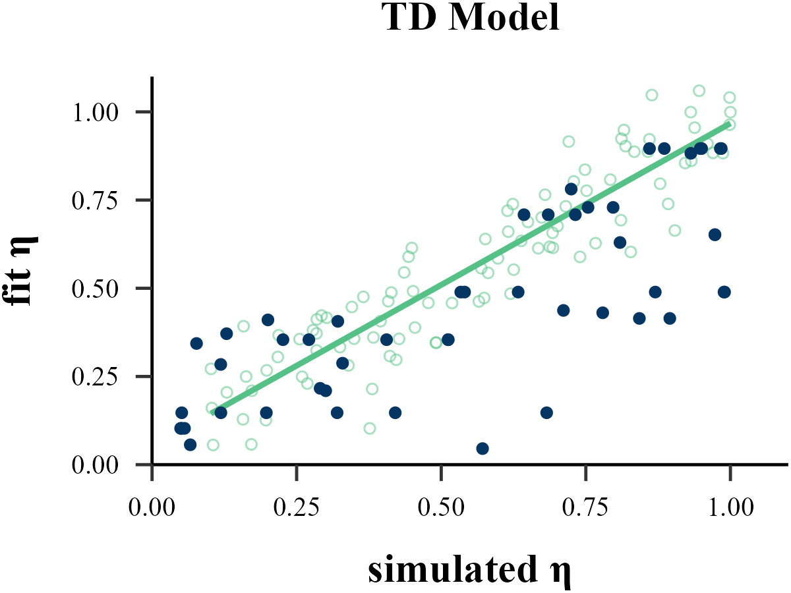
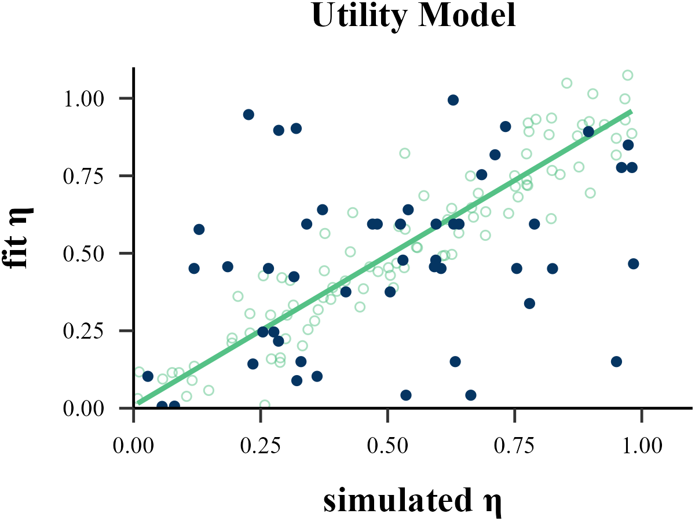
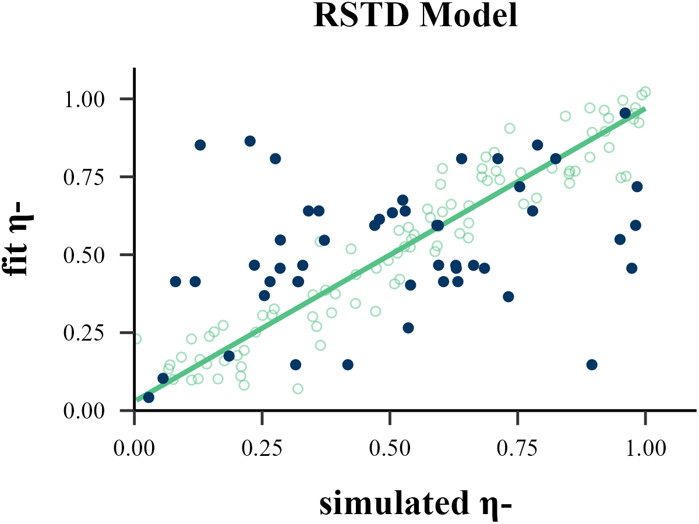
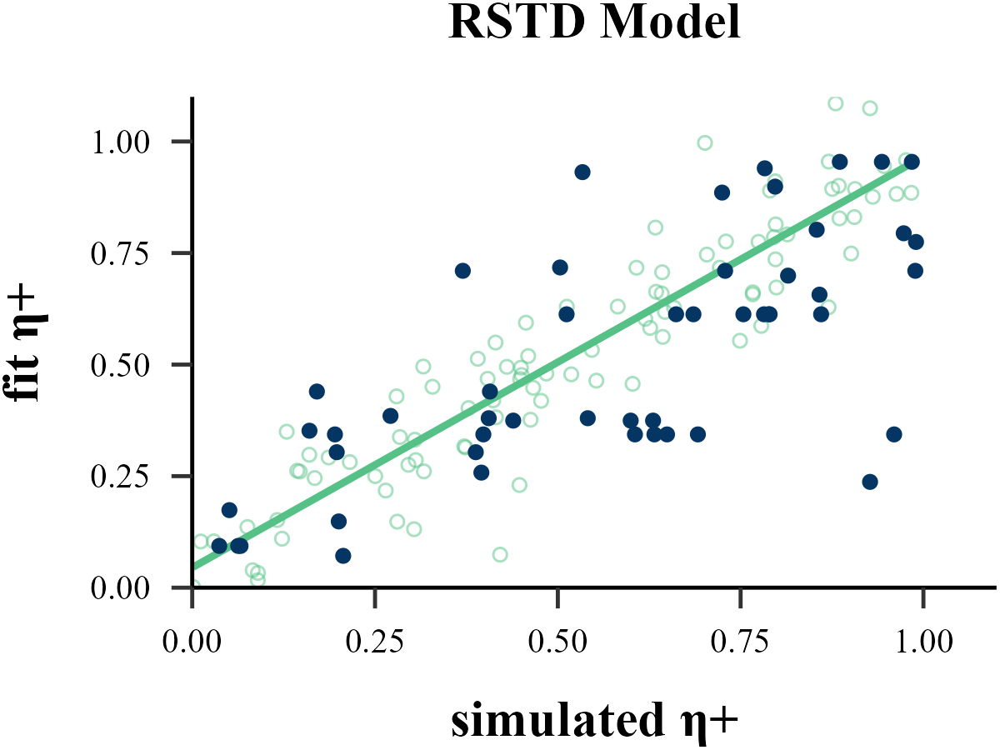
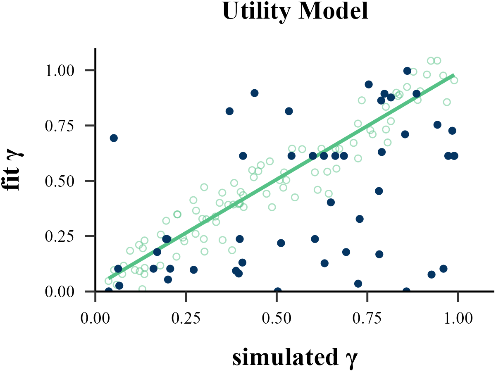
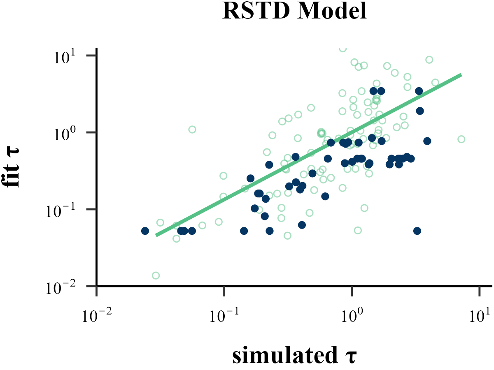
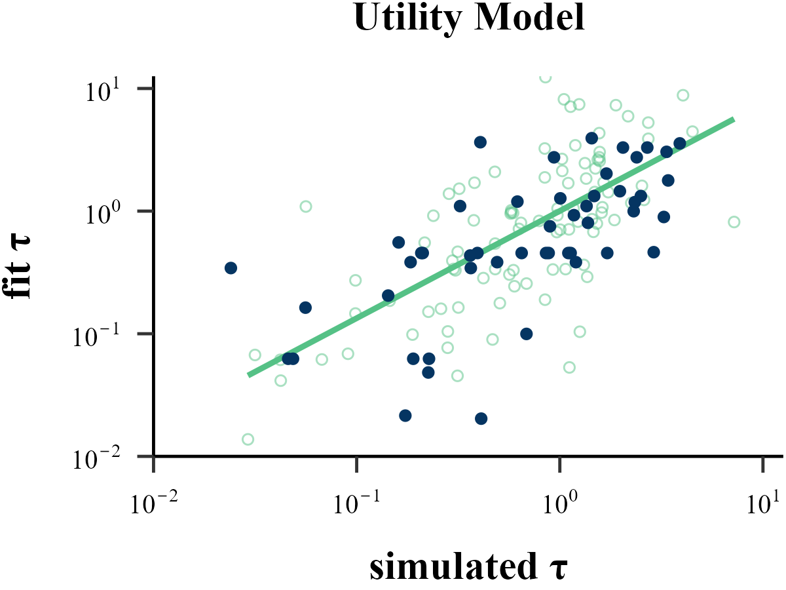
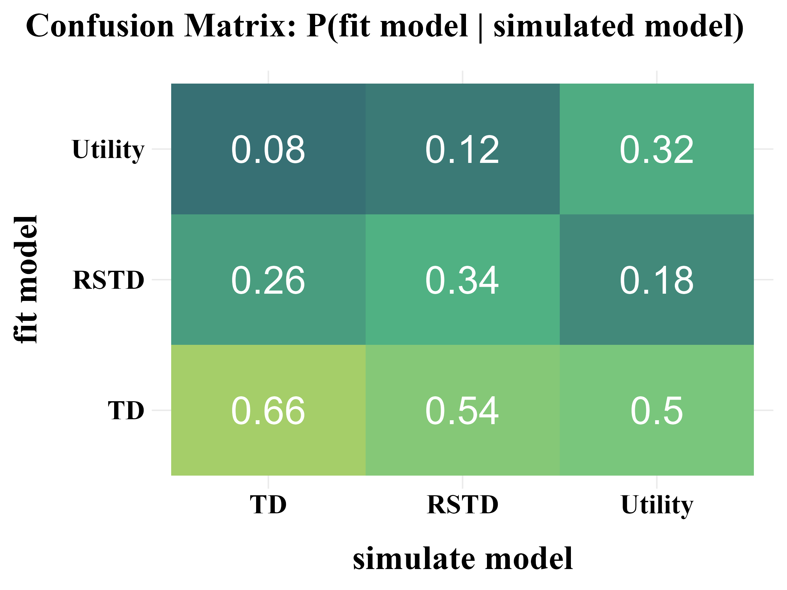

```{r include=FALSE}
library(dplyr)
library(ggplot2)
```

```{r eval=FALSE}
recovery <- binaryRL::rcv_d(
  data = binaryRL::Mason_2024_Exp2,
  id = 1,
  n_trials = 360,
  model_names = c("TD", "RSTD", "Utility"),
  simulate_models = list(binaryRL::TD, binaryRL::RSTD, binaryRL::Utility),
  simulate_lower = list(c(0, 1), c(0, 0, 1), c(0, 0, 1)),
  simulate_upper = list(c(1, 1), c(1, 1, 1), c(1, 1, 1)),
  fit_models = list(binaryRL::TD, binaryRL::RSTD, binaryRL::Utility),
  fit_lower = list(c(0, 1), c(0, 0, 1), c(0, 0, 1)),
  fit_upper = list(c(1, 6), c(1, 1, 6), c(1, 1, 6)),
  iteration_s = 100,
  iteration_f = 50,
  seed = 123,
  nc = 10,
  #algorithm = "L-BFGS-B"     # Gradient-Based (stats::optim)
  #algorithm = "GenSA"        # Simulated Annealing (GenSA)
  #algorithm = "GA"           # Genetic Algorithm (GA)
  #algorithm = "DEoptim"      # Differential Evolution (DEoptim)
  #algorithm = "PSO"          # Particle Swarm Optimization (pso)
  algorithm = "Bayesian"     # Bayesian Optimization (mlrMBO)
  #algorithm = "CMA-ES"       # Covariance Matrix Adapting (cmaes)
  #algorithm = "NLOPT_GN_MLSL"# Nonlinear Optimization (nloptr)
)

result <- dplyr::bind_rows(recovery) %>%
  dplyr::select(simulate_model, fit_model, iteration, everything())

write.csv(result, file = "../OUTPUT/result_recovery.csv", row.names = FALSE)
```

## Parameter Recovery

<details>
<summary>Plot Function</summary>
```{r eval=FALSE}
plot_param_rcv <- function(
  data = read.csv("../OUTPUT/result_recovery.csv"),
  model,
  param_index,
  param_name,
  rate,
  filename
){
  data <- data %>%
    dplyr::filter(simulate_model == fit_model & simulate_model == model) %>%
    dplyr::mutate(
      input_param = .data[[paste0("input_param_", param_index)]],
      output_param = .data[[paste0("output_param_", param_index)]]
    )
  
  if (param_name == "τ") {
    if (min(data$input_param) > 1) {
      data <- data %>%
        dplyr::mutate(
          input_param = log10(input_param - 1),
          output_param = log10(output_param - 1)
        )
      param_name <- "τ-1"
    }
    else if ((min(data$input_param) <= 1)) {
      data <- data %>%
        dplyr::mutate(
          input_param = log10(input_param),
          output_param = log10(output_param)
        )
    }
    
    set.seed(123)
    x <- rexp(100, rate = rate)
    
    norm <- data.frame(
      x = log10(x),
      y = log10(x) + sample(c(-1, 1), 100, replace = TRUE) * log10(rexp(100, rate = rate))
    )
    
    x_min <- floor(quantile(norm$x, 0.05, na.rm = TRUE))
    x_max <- ceiling(quantile(norm$x, 0.95, na.rm = TRUE))
    
    y_min <- floor(quantile(norm$y, 0.05, na.rm = TRUE))
    y_max <- ceiling(quantile(norm$y, 0.95, na.rm = TRUE))
  } else {
    x <- runif(100, 0, 1)
    norm <- data.frame(
      x = x,
      y = x + rnorm(100, 0, 0.1)
    )
    
    x_min <- trunc(min(norm$x))
    if (max(norm$x) < 1) {
      x_max <- 1
    }
    else {
      x_max <- trunc(max(norm$x))
    }
    
    y_min <- trunc(min(norm$y))
    if (max(norm$y) < 1) {
      y_max <- 1
    }
    else {
      y_max <- trunc(max(norm$y))
    }
  }

  plot <- ggplot2::ggplot(data, aes(x = input_param, y = output_param)) +
    ggplot2::geom_smooth(
      data = norm,
      mapping = aes(x = x, y = y),
      method = "lm", color = "#55c186", se = FALSE
    ) +
    ggplot2::geom_point(
      data = norm,
      mapping = aes(x = x, y = y),
      color = "#55c186",  
      alpha = 0.5, shape = 1
    ) +
    ggplot2::geom_point(color = "#053562") +  # 绘制散点
    ggplot2::scale_y_continuous(
      limits = c(y_min, y_max + 0.1), expand = c(0, 0),
      labels = 
        if (grepl("τ", param_name)) {
          function(x) parse(text = paste0("10^", x))
        } 
        else {
          waiver()  
        }
    ) +
    ggplot2::scale_x_continuous(
      limits = c(x_min, x_max + 0.1), expand = c(0, 0),
      labels = 
        if (grepl("τ", param_name)) {
          function(x) parse(text = paste0("10^", x))
        } 
        else {
          waiver()  
        }
    ) +
    ggplot2::labs(
      x = paste("simulated", param_name),
      y = paste("fit", param_name),
      title = paste(model, "Model")
    ) +
    papaja::theme_apa() +
    ggplot2::theme(
      text = element_text(
        family = "serif", 
        face = "bold",
        size = 15
      ),
      axis.text = element_text(
        color = "black",
        family = "serif", 
        face = "plain",
        size = 10
      ),
      plot.title = element_text(
        family = "serif", face = "bold",
        size = 15, hjust = 0.5
      ),
      plot.margin = margin(t = 1, r = 1, b = 1, l = 1),
    )
  
  ggplot2::ggsave(
    plot = plot,
    filename = filename, 
    width = 4, height = 3
  ) 
  
  return(plot)
}
```
</details>

### eta
```{r eval=FALSE}
#| label: plot_eta
#| fig.alt: "plot input eta and output eta"
#| 
plot_param_rcv(
  data = read.csv("../OUTPUT/result_recovery.csv"),
  model = "TD",
  param_index = 1,
  param_name = "η",
  filename = "../FIGURE/1_TD_eta.png"
)

plot_param_rcv(
  data = read.csv("../OUTPUT/result_recovery.csv"),
  model = "RSTD",
  param_index = 1,
  param_name = "η-",
  filename = "../FIGURE/2_RSTD_eta1.png"
)

plot_param_rcv(
  data = read.csv("../OUTPUT/result_recovery.csv"),
  model = "RSTD",
  param_index = 2,
  param_name = "η+",
  filename = "../FIGURE/2_RSTD_eta2.png"
)

plot_param_rcv(
  data = read.csv("../OUTPUT/result_recovery.csv"),
  model = "Utility",
  param_index = 1,
  param_name = "η",
  filename = "../FIGURE/3_Utility_eta.png"
)
```

<p align="center">
  
  
</p>

<p align="center">
  
  
</p>

```{r}
data <- read.csv("../OUTPUT/result_recovery.csv") %>%
  dplyr::filter(simulate_model == fit_model & simulate_model == "TD") 
cor(data$input_param_1, data$output_param_1)

data <- read.csv("../OUTPUT/result_recovery.csv") %>%
  dplyr::filter(simulate_model == fit_model & simulate_model == "RSTD") 
cor(data$input_param_1, data$output_param_1)

data <- read.csv("../OUTPUT/result_recovery.csv") %>%
  dplyr::filter(simulate_model == fit_model & simulate_model == "RSTD") 
cor(data$input_param_2, data$output_param_2)

data <- read.csv("../OUTPUT/result_recovery.csv") %>%
  dplyr::filter(simulate_model == fit_model & simulate_model == "Utility") 
cor(data$input_param_1, data$output_param_1)
```

### gamma
```{r eval=FALSE}
#| label: plot_gamma
#| fig.alt: "plot input gamma and output gamma"
#| 
plot_param_rcv(
  data = read.csv("../OUTPUT/result_recovery.csv"),
  model = "Utility",
  param_index = 2,
  param_name = "γ",
  filename = "../FIGURE/3_Utility_gamma.png"
)
```

<p align="center">
  
</p>

```{r}
data <- read.csv("../OUTPUT/result_recovery.csv") %>%
  dplyr::filter(simulate_model == fit_model & simulate_model == "Utility") 
cor(data$input_param_2, data$output_param_2)
```

### tau
```{r eval=FALSE}
#| label: plot_tau
#| fig.alt: "plot input tau and output tau"
#| 
plot_param_rcv(
  data = read.csv("../OUTPUT/result_recovery.csv"),
  model = "TD",
  param_index = 2,
  param_name = "τ",
  rate = 1,
  filename = "../FIGURE/1_TD_tau.png"
)

plot_param_rcv(
  data = read.csv("../OUTPUT/result_recovery.csv"),
  model = "RSTD",
  param_index = 3,
  param_name = "τ",
  rate = 1,
  filename = "../FIGURE/2_RSTD_tau.png"
)

plot_param_rcv(
  data = read.csv("../OUTPUT/result_recovery.csv"),
  model = "Utility",
  param_index = 3,
  param_name = "τ",
  rate = 1,
  filename = "../FIGURE/3_Utility_tau.png"
)
```

<p align="center">
  
  
  
</p>

```{r}
data <- read.csv("../OUTPUT/result_recovery.csv") %>%
  dplyr::filter(simulate_model == fit_model & simulate_model == "TD") 
cor(data$input_param_2, data$output_param_2)

data <- read.csv("../OUTPUT/result_recovery.csv") %>%
  dplyr::filter(simulate_model == fit_model & simulate_model == "RSTD") 
cor(data$input_param_3, data$output_param_3)

data <- read.csv("../OUTPUT/result_recovery.csv") %>%
  dplyr::filter(simulate_model == fit_model & simulate_model == "Utility") 
cor(data$input_param_3, data$output_param_3)
```

## Model Recovery
<details>
<summary>Plot Function</summary>

```{r eval=FALSE}
plot_model_rcv <- function(
  data = read.csv("../OUTPUT/result_recovery.csv"),
  matrix_type,
  filename
){
  data <- data %>%
    dplyr::select(simulate_model, fit_model, iteration, BIC) %>%
    tidyr::pivot_wider(names_from = "fit_model", values_from = "BIC") %>%
    dplyr::mutate(
      TD_score = ifelse(TD == pmin(TD, RSTD, Utility), 1, 0),
      RSTD_score = ifelse(RSTD == pmin(TD, RSTD, Utility), 1, 0),
      Utility_score = ifelse(Utility == pmin(TD, RSTD, Utility), 1, 0)
    ) %>% 
    dplyr::select(simulate_model, TD_score, RSTD_score, Utility_score) %>%
    dplyr::group_by(simulate_model) %>%
    dplyr::summarise(
      TD = round(mean(TD_score), 2),
      RSTD = round(mean(RSTD_score), 2),
      Utility = round(mean(Utility_score), 2),
    ) %>%
    dplyr::ungroup() %>%
    dplyr::arrange(factor(simulate_model, levels = c("TD", "RSTD", "Utility"))) %>%
    tidyr::pivot_longer(
      cols = -simulate_model, 
      names_to = "fit_model", 
      values_to = "value"
    ) %>%
    dplyr::mutate(
      simulate = factor(simulate_model, levels = c("TD", "RSTD", "Utility")),
      fit = factor(fit_model, levels = c("TD", "RSTD", "Utility")),
    ) 
  
  switch(
    matrix_type,
    "confusion" = {
      data <- data
      title <- "Confusion Matrix: P(fit model | simulated model)"
      hjust <- 1.3
    },
    "inversion" = {
      data <- data %>%
        dplyr::group_by(fit_model) %>%
        dplyr::mutate(value = round(value / sum(value), 2)) %>%
        dplyr::ungroup()
      title <- "Inversion Matrix: P(simulated model | fit model)"
      hjust <- 1.5
    }
  )
  
  plot <- ggplot2::ggplot(data, aes(x = simulate, y = fit, fill = value)) +
    ggplot2::geom_tile() +
    ggplot2::scale_fill_gradient2(
      low = "#003161", mid = "#55c186", high = "#f0de36",
      limits = c(0, 1), 
      midpoint = 0.4       
    ) + 
    ggplot2::labs(
      title = title,
      x = "simulate model", 
      y = "fit model"
    ) + 
    ggplot2::geom_text(aes(label = value), size = 10, color = "white") +
    ggplot2::theme_minimal() +
    ggplot2::theme(
      legend.position = "none",
      panel.background = ggplot2::element_rect(fill = "white", color = NA),
      plot.background = ggplot2::element_rect(fill = "white", color = NA),
      plot.margin = margin(t = 10, r = 10, b = 10, l = 10),
      plot.title = element_text(
        family = "serif", face = "bold",
        size = 25, hjust = hjust, margin = margin(b = 20)
      ),
      axis.title.y = element_text(
        family = "serif", face = "bold",
        size = 25, margin = margin(r = 20)
      ),
      axis.title.x = element_text(
        family = "serif", face = "bold",
        size = 25, margin = margin(t = 20)
      ),
      axis.text = element_text(
        color = "black", family = "serif",  face = "bold",
        size = 20
      )
    )
  
  ggplot2::ggsave(
    plot = plot,
    filename = filename, 
    width = 8, height = 6
  )
  
  return(plot)
}
```

</details>

```{r eval=FALSE}
#| label: model_recovery
#| fig.alt: "confusion matrix and inversion matrix"
#| 
plot_model_rcv(
  data = read.csv("../OUTPUT/result_recovery.csv"),
  matrix_type = "confusion",
  filename = "../FIGURE/matrix_confusion.png"
)

plot_model_rcv(
  data = read.csv("../OUTPUT/result_recovery.csv"),
  matrix_type = "inversion",
  filename = "../FIGURE/matrix_inversion.png"
)
```

<p align="center">
    
    
</p>
