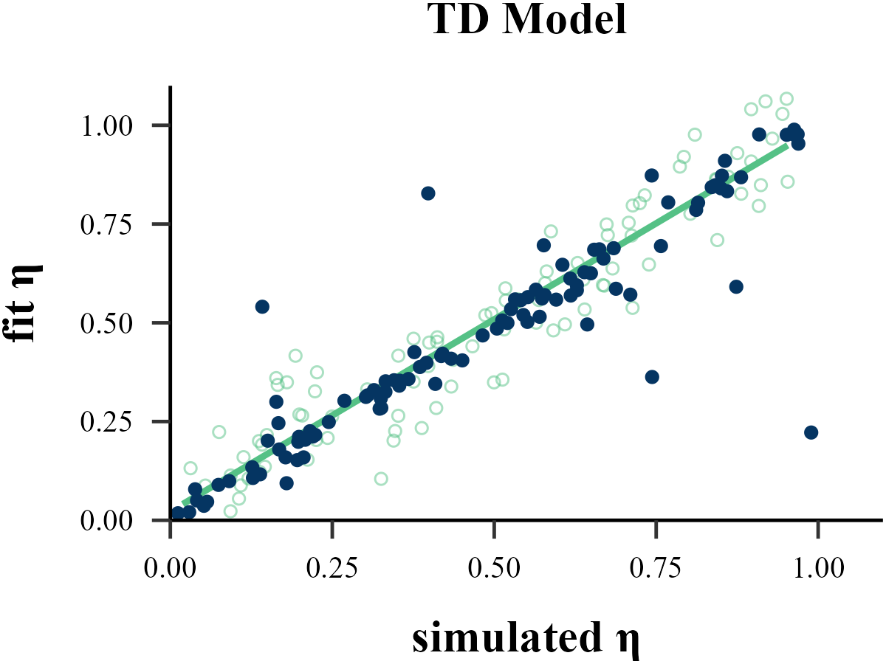
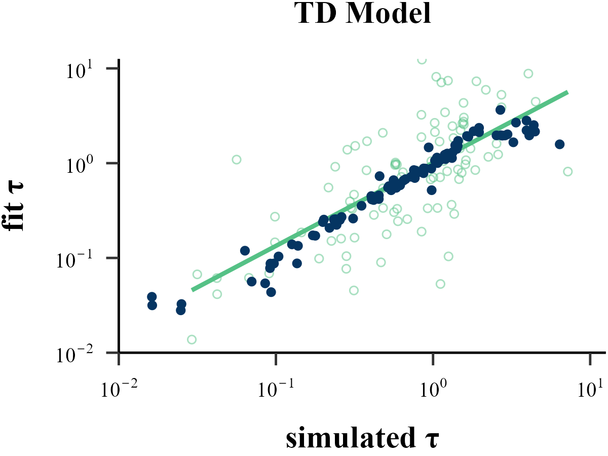

Traditional methods like MLE, MAP, MCMC all operate on a similar principle: they start with a set of parameters, run a reinforcement learning model to generate a sequence of choices, and then evaluate the similarity between this simulated sequence and the human subject's behavior to determine if the parameters are optimal.

**Approximate Bayesian Computation** (ABC) follows a similar **Recurrent Neural Network (RNN)**. However, instead of learning a direct mapping from the entire behavioral sequence to the parameters, ABC focuses on the relationship between the input parameters and a set of summary statistics derived from the output. By condensing the full behavioral data into these key statistical features, ABC requires significantly less information and computational resources than a sequence-based model like an RNN. Crucially, despite this simplification, ABC often yields parameter recovery results that are substantially more robust and accurate than those from traditional methods like MLE.

## Install Package
```{r eval=FALSE}
install.packages("abc")
```

## Simulating Data

```{r eval=FALSE}
list_simulated <- binaryRL::simulate_list(
  data = binaryRL::Mason_2024_G2,
  id = 1,
  n_params = 2,
  n_trials = 360,
  
  obj_func = binaryRL::TD,
  rfun = list(
    eta = function() { stats::runif(n = 1, min = 0, max = 1) },
    tau = function() { stats::rexp(n = 1, rate = 1) }
  ),
  iteration = 1100 # = [1000(train) + 100(valid)]]
)

list_train <- list_simulated[1:1000]
list_valid <- list_simulated[1001:1100]
```

## Step 1: Free Parameters

```{r eval=FALSE}
extract_params <- function(x) {
  param_vector <- x$input
  names(param_vector) <- c("eta", "tau")
  return(param_vector)
}

# parameters for training
df_train.params <- dplyr::bind_rows(
  .x = purrr::map(.x = list_train, .f = extract_params)
)

df_valid.params <- dplyr::bind_rows(
  .x = purrr::map(.x = list_valid, .f = extract_params)
)
```

## Step 2: Summary Statistics

```{r eval=FALSE}
extract_sumstats <- function(x) {
  x[["data"]] %>%
    dplyr::filter(Frame %in% c("Gain", "Loss")) %>%
    dplyr::mutate(
      Risky = case_when(
        Sub_Choose %in% c("A", "C") ~ 0,
        Sub_Choose %in% c("B", "D") ~ 1
      )
    ) %>%
    dplyr::group_by(Block) %>%
    dplyr::summarise(
      mean_risky = mean(Risky),
      sd_risky = sd(Risky),
    ) %>%
    tidyr::pivot_longer(
      cols = -Block,
      names_to = "metric",
      values_to = "value"
    ) %>%
    tidyr::pivot_wider(
      names_from = c(Block, metric),
      values_from = value
    )
}

# summary statistics for training
df_train.sumstats <- dplyr::bind_rows(
  .x = purrr::map(.x = list_train, .f = extract_sumstats)
)

# summary statistics for validation
df_valid.sumstats <- dplyr::bind_rows(
  .x = purrr::map(.x = list_valid, .f = extract_sumstats)
)
```

## Step 3: Training ABC Model

```{r eval=FALSE}
df_true <- df_valid.params
df_pred <- data.frame(
  eta = NA,
  tau = NA
)

for (i in 1:100) {
  result <- abc::abc(
    target = as.vector(df_valid.sumstats[i, ]), 
    param = df_train.params, 
    sumstat = df_train.sumstats, 
    tol = .1, 
    method = "neuralnet", 
    transf = c("logit", "none"),
    logit.bounds = rbind(c(0, 1), c(NA, NA))
  )
  
  df_pred[i, ] <- summary(result)[5, ]
}
```

## Parameter Recovery

```{r eval=FALSE}
cor(df_true$eta, df_pred$eta)
cor(df_true$tau, df_pred$tau)
```

```
[1] 0.9077516
[1] 0.8435579
```

<p align="center">
  
  
</p>

```{r eval=FALSE}
rm(list_simulated, list_train, list_valid)
rm(extract_params, df_train.params, df_valid.params)
rm(extract_sumstats, df_train.sumstats, df_valid.sumstats)
rm(result, i)
```


