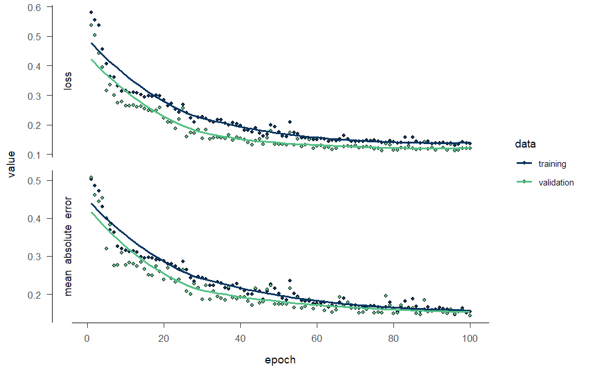
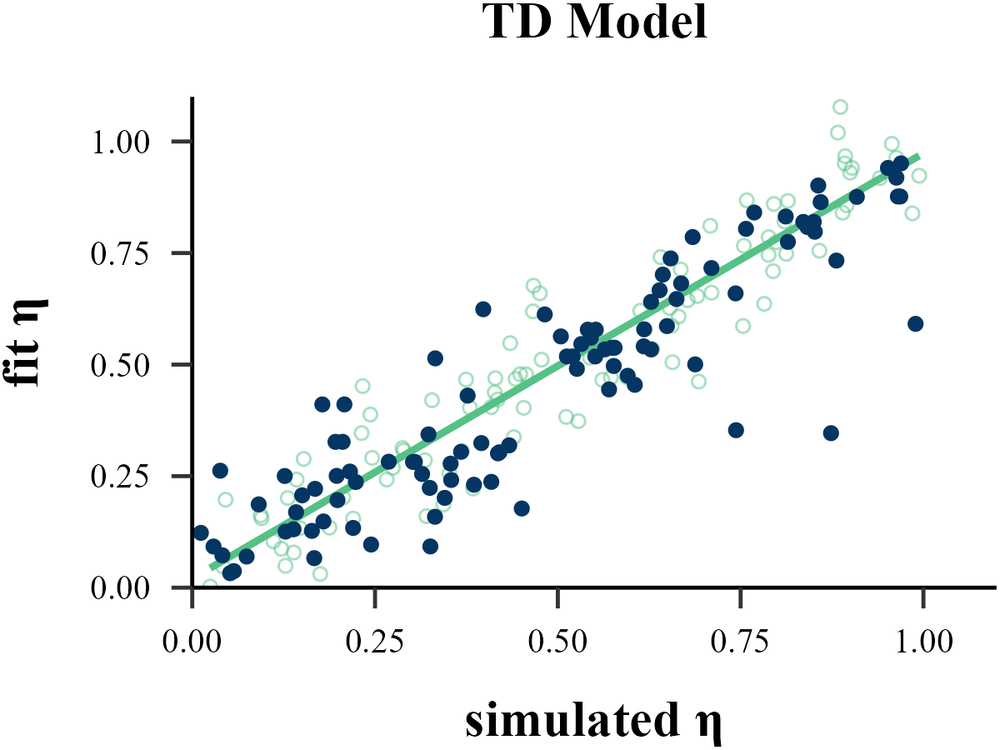
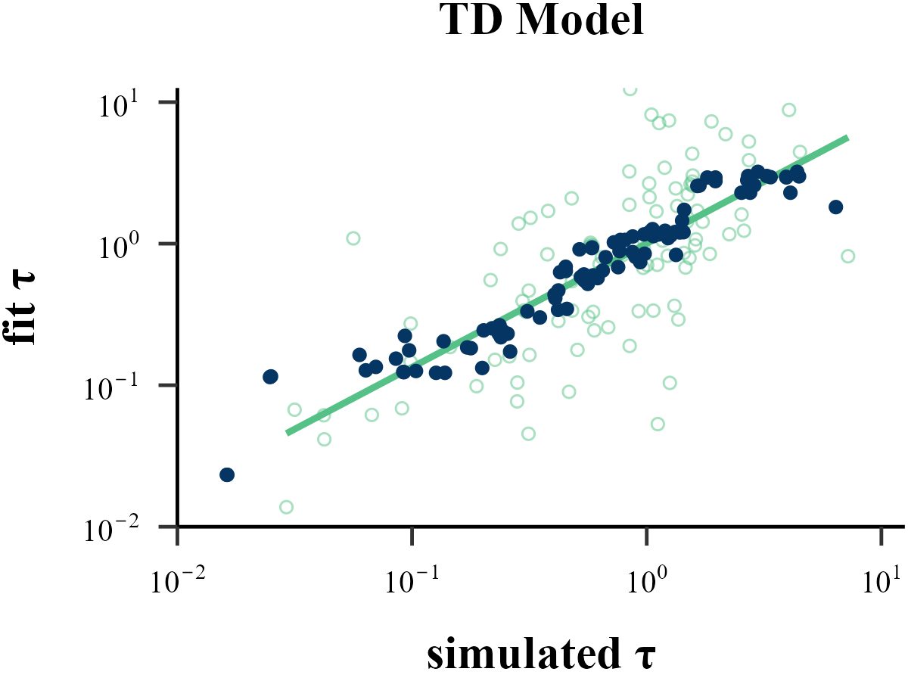

Traditional methods like MLE, MAP, MCMC all operate on a similar principle: they start with a set of parameters, run a reinforcement learning model to generate a sequence of choices, and then evaluate the similarity between this simulated sequence and the human subject's behavior to determine if the parameters are optimal.

In contrast, **Recurrent Neural Network (RNN)** uses a reverse approach. It takes a large number of choice sequences, each generated by different parameters, as input, and parameters that generated those sequences, as output. By training this large-scale model, a direct mapping between behavior and parameters is established. Once the neural network is trained, it can be given a new sequence of choices and can directly infer which parameters likely generated it.

## Install Packages

```
# You need to accept three terms of the conda license to install Miniconda.
conda tos accept --override-channels --channel https://repo.anaconda.com/pkgs/main
conda tos accept --override-channels --channel https://repo.anaconda.com/pkgs/r
conda tos accept --override-channels --channel https://repo.anaconda.com/pkgs/msys2
```

```{r eval=FALSE}
reticulate::install_miniconda()
```

[Install TensorFlow](https://www.tensorflow.org/install/pip) according to system and CPU/GPU

```
# To run TensorFlow, you need to downgrade NumPy.
conda install numpy=1.26.4
```

## Simulating Data

```{r eval=FALSE}
list_simulated <- binaryRL::simulate_list(
  data = binaryRL::Mason_2024_G2,
  id = 1,
  n_params = 2,
  n_trials = 360,
  
  obj_func = binaryRL::TD,
  rfun = list(
    eta = function() { stats::runif(n = 1, min = 0, max = 1) },
    eta = function() { stats::runif(n = 1, min = 0, max = 1) },
    tau = function() { stats::rexp(n = 1, rate = 1) }
  ),
  iteration = 1100 # = [800(train) + 200(valid)] + [100(test recovery)]
)
```

```{r eval=FALSE}
n_sample = 1000
n_trials = 360
n_info = 3
n_params = 2
```

## Step 1: List to Matrix

```{r eval=FALSE}
# create NULL list
X_list<- list()
Y_list <- list()

# obtain options
unique_L <- unique(list_simulated[[1]]$data$L_choice)
unique_R <- unique(list_simulated[[1]]$data$R_choice)
options <- sort(unique(c(unique_L, unique_R)))
options <- as.vector(options)

# as.matrix
for (i in 1:n_sample) {
  
  # Input Info: L_choice, R_choice, Sub_Choose
  X_list[[i]] <- as.matrix(
    data.frame(
      L_choice = match(
        x = list_simulated[[i]]$data$L_choice, 
        table = options
      ),
      R_choice = match(
        x = list_simulated[[i]]$data$R_choice, 
        table = options
      ),
      Choose = match(
        x = list_simulated[[i]]$data$Sub_Choose, 
        table = options
      )
    )
  )
  
  # Output Info: RL Model Parameters
  Y_list[[i]] <- as.matrix(
    do.call(
      what = data.frame,
      args = lapply(
        X = 1:length(list_simulated[[i]]$input),
        FUN = function(j) {
          list_simulated[[i]]$input[[j]]
        }
      )
    )
  )
}
```

## Step 2: Matrix to Array

```{r eval=FALSE}
# Input: n_sample, n_trials, n_info
X <- array(NA, dim = c(n_sample, n_trials, n_info))

for (i in 1:n_sample) {
  X[i, , ] <- X_list[[i]]
}

# Output: n_sample, n_params
Y <- array(NA, dim = c(n_sample, n_params))

for (i in 1:n_sample) {
  Y[i, ] <- Y_list[[i]]
}
```

## Step 3: Train & Valid

```{r eval=FALSE}
train_indices <- 1:floor(0.8 * n_sample)
valid_indices <- -train_indices

X_train <- X[train_indices, , , drop = FALSE]
X_valid <- X[valid_indices, , , drop = FALSE]

Y_train <- Y[train_indices, , drop = FALSE]
Y_valid <- Y[valid_indices, , drop = FALSE]
```

## Step 4: Training RNN Model

```{r}
#reticulate::use_condaenv("tf-cpu", required = TRUE)
reticulate::use_condaenv("tf-gpu", required = TRUE)
```

```{r eval=FALSE}
# Initialize Model (sequential decision making)
Model <- keras::keras_model_sequential()

algorithm = "GRU"
#algorithm = "LSTM"

# Recurrent Layer
switch(
  EXPR = algorithm, 
  "GRU" = {
    Model <- keras::layer_gru(
      object = Model,
      units = 128,
      input_shape = c(n_trials, n_info), 
      return_sequences = FALSE, 
    ) 
  },
  "LSTM" = {
    Model <- keras::layer_lstm(
      object = Model,
      units = 128,
      input_shape = c(n_trials, n_info), 
      return_sequences = FALSE, 
    ) 
  },
) |>
  # Hidden Layer
  keras::layer_dense(
    units = 64, 
    activation = "relu"
  ) |>
  # Output Layer
  keras::layer_dense(
    units = n_params, 
    activation = "linear"
  ) |>
  # Loss Function
  keras::compile(
    loss = "mean_squared_error",
    optimizer = "adam",
    metrics = c("mean_absolute_error")
  )

# Training RNN Model
history <- Model |>
  keras::fit(
  x = X_train,
  y = Y_train,
  epochs = 100,
  batch_size = 10,
  validation_data = list(X_valid, Y_valid),
  verbose = 2
)
```

<p align="center">
    
</p>

## Parameter Recovery

```{r eval=FALSE}
X_pred_list <- vector("list", length = 100) 
X_true_list <- vector("list", length = 100)

for (i in (n_sample + 1):(n_sample + 100)) {

  X_sub <- array(NA, dim = c(1, n_trials, n_info))
  
  X_sub[1, , ] <- as.matrix(
    data.frame(
      L_choice = match(
        x = list_simulated[[i]]$data$L_choice, 
        table = options
      ),
      R_choice = match(
        x = list_simulated[[i]]$data$R_choice, 
        table = options
      ),
      Choose = match(
        x = list_simulated[[i]]$data$Sub_Choose, 
        table = options
      )
    )
  )

################################## [core] ######################################
  X_pred <- predict(object = Model, x = X_sub)
################################## [core] ######################################
  
  X_pred_list[[i - n_sample]] <- X_pred
  X_true_list[[i - n_sample]] <- list_simulated[[i]]$input
}
```

```{r eval=FALSE}
df_true <- as.data.frame(do.call(rbind, X_true_list))
df_pred <- as.data.frame(do.call(rbind, X_pred_list))

cor(df_true$V1, df_pred$V1)
cor(df_true$V2, df_pred$V2)
```

```
[1] 0.8988817
[1] 0.8428525
```

<p align="center">
  
  
</p>

```{r eval=FALSE}
rm(unique_L, unique_R)
rm(X_list, Y_list)
rm(X, Y)
rm(algorithm, X_train, X_valid, Y_train, Y_valid, train_indices, valid_indices)
rm(i, X_sub, X_pred, n_sample, n_trials, n_info, n_params, options)
rm(X_pred_list, X_true_list)
```

