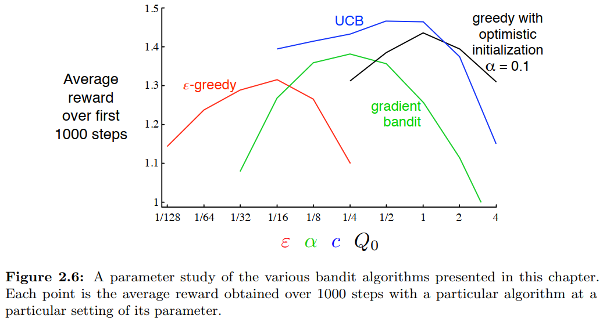

## Value Function

### Utility Function  

The subjective value of objective rewards is a topic that requires discussion, as different scholars may have different perspectives. This can be traced back to the **Stevens's Power Law**. In this model, you can customize your utility function. By default, I use a power function based on Stevens' power law to model the relationship between subjective and objective value.

According to **Kahneman's Prospect Theory**, individuals exhibit distinct utility functions for **gains** and **losses**. Referencing Nilsson et al. [(2012)](https://doi.org/10.1016/j.jmp.2010.08.006), we have implemented the model below.  

```{r eval=FALSE}
func_gamma <- function(
  i, L_freq, R_freq, L_pick, R_pick, L_value, R_value, var1 = NA, var2 = NA,  
  value, utility, reward, occurrence,
  gamma, alpha, beta
){
  # Stevens's Power Law
  if (length(gamma) == 1) {
    gamma <- as.numeric(gamma)
    utility <- sign(reward) * (abs(reward) ^ gamma)
  }
  # Prospect Theory
  else if (length(gamma) == 2 & reward < 0) {
    gamma <- as.numeric(gamma[1])
    beta <- as.numeric(beta)
    
    utility <- beta * sign(reward) * (abs(reward) ^ gamma)
  }
  else if (length(gamma) == 2 & reward >= 0) {
    gamma <- as.numeric(gamma[2])
    beta <- 1
    
    utility <- beta * sign(reward) * (abs(reward) ^ gamma)
  }
  else {
    utility <- "ERROR" 
  }
  return(list(gamma, utility))
}
```

**Reference**  

Kahneman, D., & Tversky, A. (2013). Prospect theory: An analysis of decision under risk. In Handbook of the fundamentals of financial decision making: Part I (pp. 99-127).  https://doi.org/10.1142/9789814417358_0006  

Nilsson, H., Rieskamp, J., & Wagenmakers, E. J. (2011). Hierarchical Bayesian parameter estimation for cumulative prospect theory. *Journal of Mathematical Psychology, 55*(1), 84-93. https://doi.org/10.1016/j.jmp.2010.08.006

<!---------------------------------------------------------->

### Learning Rate
In `run_m`, there is an argument called `initial_value`. Considering that the initial value has a significant impact on the parameter estimation of the **learning rates ($\eta$)** When the initial value is not set (`initial_value = NA`), it is taken to be the reward received for that stimulus the first time.

> "Comparisons between the two learning rates generally revealed a positivity bias ($\alpha_{+} > \alpha_{-}$)"  
> "However, that on some occasions, studies failed to find a positivity bias or even reported a negativity bias ($\alpha_{+} < \alpha_{-}$)."  
> "Because Q-values initialization markedly affect learning rate and learning bias estimates."

```{r eval=FALSE}
binaryRL::run_m(
  ...,
  initial_value = NA,
  ...
)
```

**Reference**  

Palminteri, S., & Lebreton, M. (2022). The computational roots of positivity and confirmation biases in reinforcement learning. *Trends in Cognitive Sciences, 26*(7), 607-621. https://doi.org/10.1016/j.tics.2022.04.005

## Exploration–Exploitation Trade-off  

> "The ε-greedy methods choose randomly a small fraction of the time, whereas UCB methods choose deterministically but achieve exploration by subtly favoring at each step the actions that have so far received fewer samples. Gradient bandit algorithms estimate not action values, but action preferences, and favor the more preferred actions in a graded, probabilistic manner using a soft-max distribution. The simple expedient of initializing estimates optimistically causes even greedy methods to explore significantly."  

<p align="center">
    
</p>

**Reference**  

Sutton, R. S., & Barto, A. G. (2018). *Reinforcement Learning: An Introduction* (2nd ed). MIT press.  

### Initial Value

> "Initial action values can also be used as a simple way to encourage exploration. Suppose that instead of setting the initial action values to zero, as we did in the 10-armed testbed, we set them all to +5. Recall that the $q_{*}(a)$ in this problem are selected from a normal distribution with mean 0 and variance 1. An initial estimate of +5 is thus wildly optimistic. But this optimism encourages action-value methods to explore."  

**Reference**  

Sutton, R. S., & Barto, A. G. (2018). *Reinforcement Learning: An Introduction* (2nd ed). MIT press.  

### Epsilon Related

Participants in the experiment may not always choose based on the value of the options, but instead select randomly on some trials. This is known as exploration strategy. You can implement an $\epsilon$-first model by setting the `threshold` parameter in the `run_m`. For instance, if the threshold is set to `threshold = 20` (The default value is set to 1), it means that participants will choose completely randomly until trial number 20, after which their choices will be based on value.  

```{r eval=FALSE}
# epsilon-first
run_m(
  ...
  threshold = 20,
  epsilon = NA,
  lambda = NA
  ...
)
```

The $\epsilon$-greedy strategy is commonly employed in reinforcement learning models. With this approach (`epsilon = 0.1`), the participant has a 10% probability of randomly selecting an option and a 90% probability of choosing based on the currently learned value of the options.  

```{r eval=FALSE}
# epsilon-greedy
run_m(
  ...
  threshold = 1,
  epsilon = 0.1,
  lambda = NA
  ...
)
```

You can also create an $\epsilon$-decreasing exploration strategy by setting `lambda` instead of `epsilon`. In this model, the probability of participants choosing randomly will decrease as the trial number increases.  

```{r eval=FALSE}
# epsilon-decreasing
run_m(
  ...
  threshold = 1,
  epsilon = NA,
  lambda = 0.1
  ...
)
```

**Reference**  

Namiki, N., Oyo, K., & Takahashi, T. (2014, December). How do humans handle the dilemma of exploration and exploitation in sequential decision making?. In Proceedings of the 8th International Conference on Bioinspired Information and Communications Technologies (pp. 113-117). https://doi.org/10.4108/icst.bict.2014.258045  
<!---------------------------------------------------------->

### Upper-Confidence-Bound

The $\pi$ parameter in Upper-Confidence-Bound (UCB) Action Selection, which is `c` in the book, is a parameter used to control the ratio of the bias value given to less-selected options. A larger value of this parameter will assign a greater bias to options that have been chosen infrequently. This value defaults to `NA`, ensuring each option is selected at least once. Once an option has been chosen, its bias will be set to zero. If $\pi$ is very small, for example 0.001, the effect is almost the same.  

```{r eval=FALSE}
run_m(
  ...
  pi = 0.1,
  ...
)
```

**Reference**  

Sutton, R. S., & Barto, A. G. (2018). *Reinforcement Learning: An Introduction* (2nd ed). MIT press.  

### Soft-Max Function

> "With continuous policy parameterization the action probabilities change smoothly as a function of the learned parameter, whereas in $\epsilon$-greedy selection the action probabilities may change dramatically for an arbitrarily small change in the estimated action values, if that change results in a different action having the maximal value."  

In many reinforcement learning models, softmax is used to represent the exploration-exploitation trade-off, rather than the three methods mentioned above.  

> "In this section we consider learning a numerical preference for each action *a*, which we denote $H_t(a) \in \mathbb{R}$. The larger the preference, the more often that action is taken, but the preference has no interpretation in terms of reward."  

Additionally, when using the `rcv_d()` function, please note the following two points. During the recovery process, the **last** element of both `simulate_lower` and `simulate_upper` corresponds to the $\tau$ parameter used in the softmax function.

- `simulate_lower` represents a fixed positive increment applied to all $\tau$ values.   
if this value is set to 1, it means that 1 is added to every $\tau$ during simulation.

- `simulate_upper` specifies the rate parameter of an exponential distribution from which $\tau$ is sampled.  
if this value is 1, then $\tau$ is drawn from an exponential distribution with a rate of 10, i.e., $\tau \sim \text{Exp}(1)$.


```{r eval=FALSE}
binaryRL::rcv_d(
  ...
  simulate_lower = list(c(0, 1), c(0, 0, 1), c(0, 0, 1)),
  simulate_upper = list(c(1, 1), c(1, 1, 1), c(1, 1, 1)),
  ...
)
```

**Reference**  

Sutton, R. S., & Barto, A. G. (2018). *Reinforcement Learning: An Introduction* (2nd ed). MIT press.  

Wilson, R. C., & Collins, A. G. (2019). Ten simple rules for the computational modeling of behavioral data. *Elife*, 8, e49547. https://doi.org/10.7554/eLife.49547

<!---------------------------------------------------------->

## Model Fit

### Loss Function

The primary aim of `binaryRL` is to enable reinforcement learning models to exhibit behaviors similar to human subjects. While there are various ways to formulate **loss functions**, the built-in loss function expresses the resemblance between human behavior and model predictions.  

$$
LL = \sum B_{L} \times \log P_{L} + \sum B_{R} \times \log P_{R}
$$ 

*NOTE:* $B_{L}$ and $B_{R}$ the option that the subject chooses. ($B_{L} = 1$: subject chooses the left option; $B_{R} = 1$: subject chooses the right option); $P_{L}$ and $P_{R}$ represent the probabilities of selecting the left or right option, as predicted by the reinforcement learning model. ${k}$ the number of free parameters in the model; ${n}$ represents the total number of trials in the paradigm.  

**Reference**  

Hampton, A. N., Bossaerts, P., & O'doherty, J. P. (2006). The role of the ventromedial prefrontal cortex in abstract state-based inference during decision making in humans. *Journal of Neuroscience, 26*(32), 8360-8367. https://doi.org/10.1523/JNEUROSCI.1010-06.2006

### AIC & BIC
Additionally, the program also calculates AIC and BIC based on the Log-Likelihood, number of parameters, and number of trials to penalize overly complex models.

  

$$
AIC =  - 2 LL + 2 k
$$

$$
BIC =  - 2 LL + k \times \log n
$$ 

**Reference**  

Akaike, H. (1974) A New Look at the Statistical Model Identification. *IEEE Transactions on Automatic Control, AC- 19*, 716-723. http://dx.doi.org/10.1109/TAC.1974.1100705  

Schwarz, G. (1978) Estimating the Dimension of a Model. *Annals of Statistics, 6*, 461-464. http://dx.doi.org/10.1214/aos/1176344136

