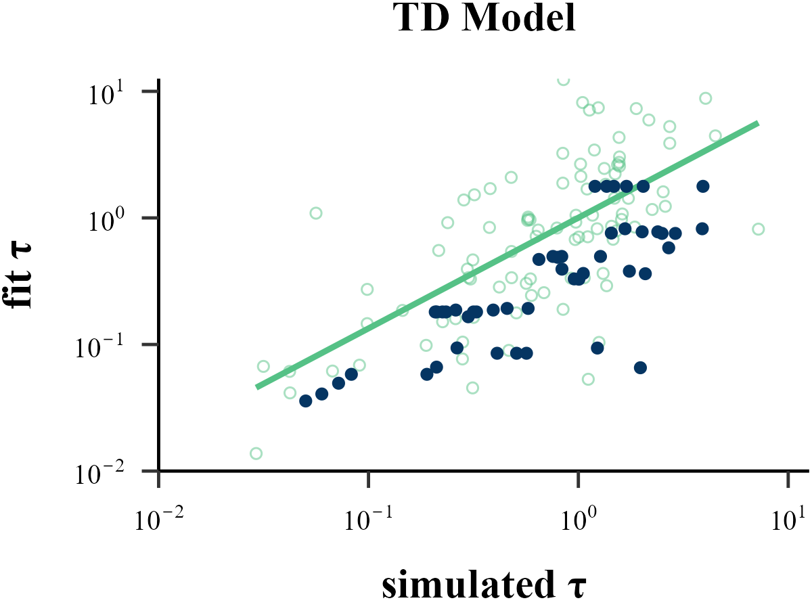
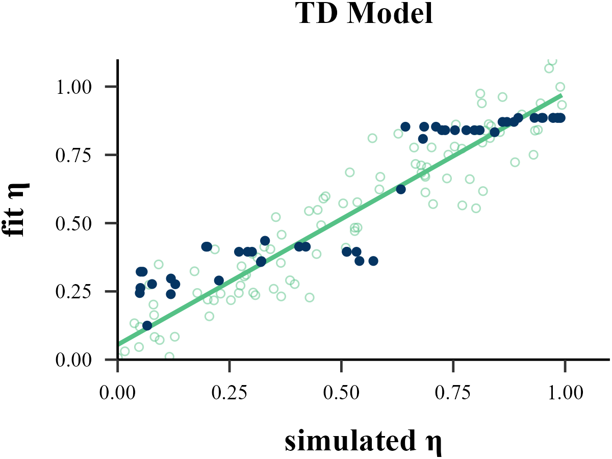
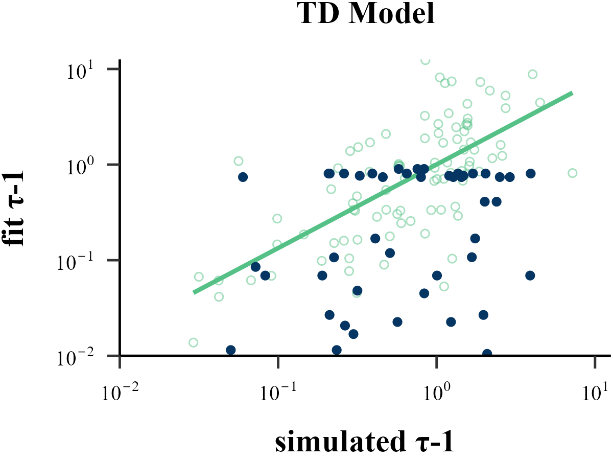
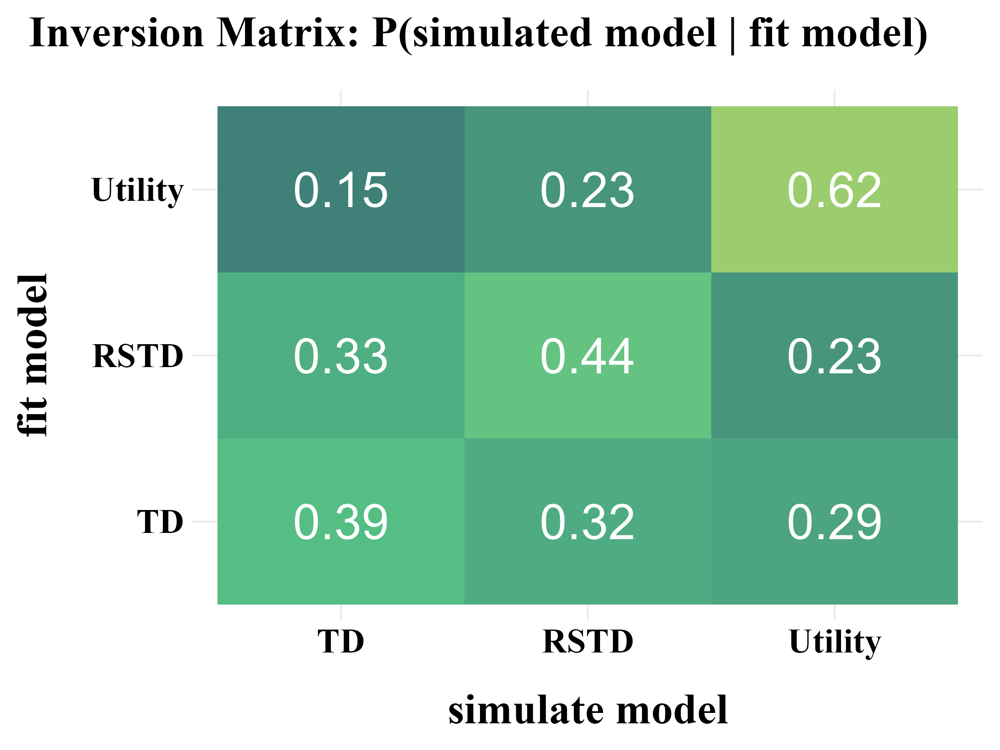
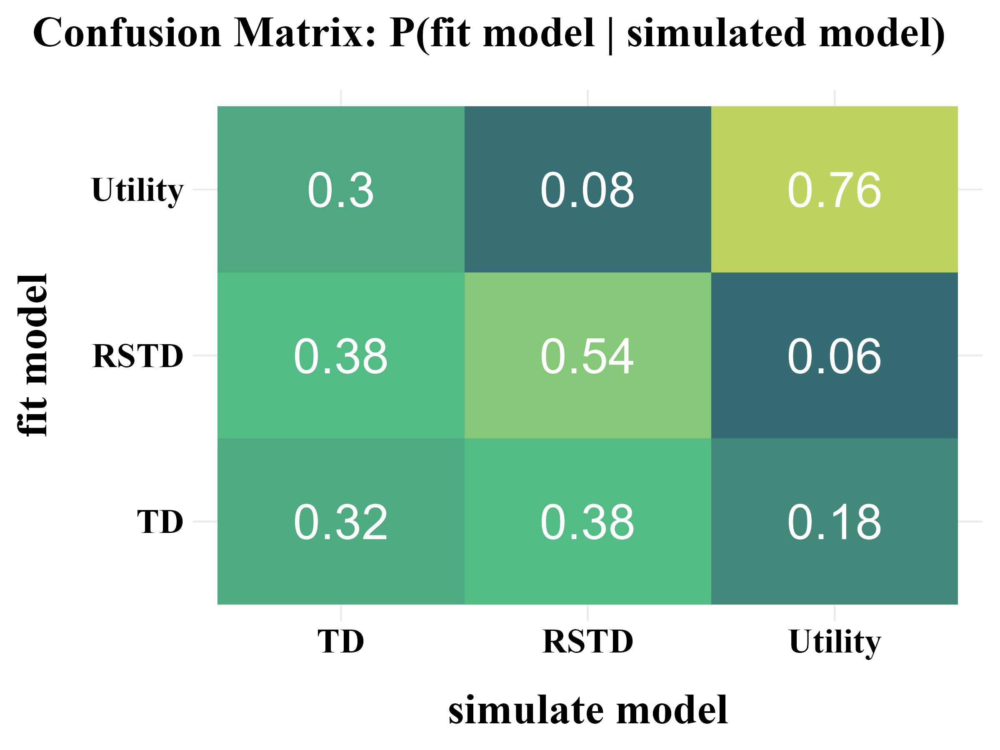
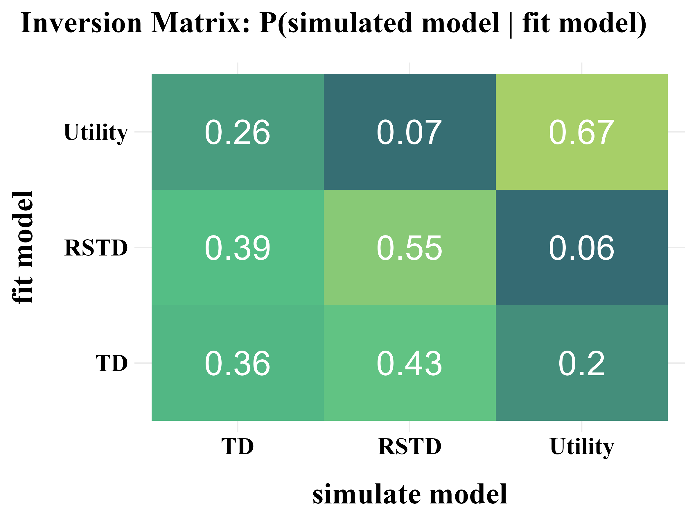

*-* The development and usage workflow of this R package adheres to the **four** stages (ten rules) recommended by Wilson & Collins [(2019)](https://doi.org/10.7554/eLife.49547).  
*-* The **three** basic models built into this R package are referenced from Niv et al. [(2012)](https://doi.org/10.1523/JNEUROSCI.5498-10.2012).

<p align="center">
    
    
</p>


**Reference**  
Wilson, R. C., & Collins, A. G. (2019). Ten simple rules for the computational modeling of behavioral data. *Elife, 8*, e49547. https://doi.org/10.7554/eLife.49547  
Niv, Y., Edlund, J. A., Dayan, P., & O'Doherty, J. P. (2012). Neural prediction errors reveal a risk-sensitive reinforcement-learning process in the human brain. *Journal of Neuroscience, 32*(2), 551-562. https://doi.org/10.1523/JNEUROSCI.5498-10.2012
<!---------------------------------------------------------->

## 1. Run Model {#1-run-model}

Create a function with **ONLY ONE** argument, `params`

```{r eval=FALSE}
Model <- function(params){

  res <- binaryRL::run_m(
    data = data,
    id = id,
    mode = mode,
    n_trials = n_trials,
    n_params = n_params,
# ╔═══════════════════════════════════╗ #
# ║ You only need to modify this part ║ #
# ║ -------- free parameters -------- ║ #
    eta = c(params[1], params[2]),
    gamma = c(params[3], params[4]),
    epsilon = c(params[5]),
    lambda = c(params[6]),
    pi = c(params[7]),
    tau = c(params[8]),
    alpha = c(param[...], param[...]),
    beta = c(param[...], param[...]),
# ║ -------- core functions --------- ║ #
    util_func = your_util_func,
    rate_func = your_rate_func,  
    expl_func = your_expl_func,
    bias_func = your_bias_func,
    prob_func = your_prob_func,
# ║ --------- column names ---------- ║ #
    sub = "Subject",
    time_line = c("Block", "Trial"),
    L_choice = "L_choice",
    R_choice = "R_choice",
    L_reward = "L_reward",
    R_reward = "R_reward",
    sub_choose = "Sub_Choose",
    var1 = "extra_Var1",
    var2 = "extra_Var2"
# ║ You only need to modify this part ║ #
# ╚═══════════════════════════════════╝ # 
  )

  assign(x = "binaryRL.res", value = res, envir = binaryRL.env)
  switch(mode, "fit" = -res$ll, "simulate" = res, "replay" = res)
}
```

<!---------------------------------------------------------->

### Custom Functions

<!---------------------------------------------------------->

You can also customize all five functions to build your own RL model. 
- The default function is applicable to three basic models (`TD`, `RSTD`, `Utility`). 

<!---------------------------------------------------------->

<details>
<summary>Utility Function (γ)</summary>

```{r eval=FALSE}
print(binaryRL::func_gamma)
```

```{r eval=FALSE}
func_gamma <- function(
  # variables before decision-making
  i, L_freq, R_freq, L_pick, R_pick, L_value, R_value,
  # variables after decision-making
  value, utility, reward, occurrence, 
  # parameters
  gamma, 
  # extra variables
  var1, var2, 
  # extra parameters
  alpha, beta 
){
  if (length(gamma) == 1) {
    gamma <- gamma
    utility <- sign(reward) * (abs(reward) ^ gamma)
  }
  else {
    utility <- "ERROR" 
  }
  return(list(gamma, utility))
}
```
</details>

<!---------------------------------------------------------->

<details>
<summary>Learning Rate Function (η)</summary>

```{r eval=FALSE}
print(binaryRL::func_eta)
```

```{r eval=FALSE}
func_eta <- function (
  # variables before decision-making
  i, L_freq, R_freq, L_pick, R_pick, L_value, R_value,
  # variables after decision-making
  value, utility, reward, occurrence, 
  # parameters
  eta, 
  # extra variables
  var1, var2, 
  # extra parameters
  alpha, beta 
){
  # TD
  if (length(eta) == 1) {
    eta <- as.numeric(eta)
  }
  # RSTD
  else if (length(eta) > 1 & utility <  value) {
    eta <- eta[1]
  }
  else if (length(eta) > 1 & utility >= value) {
    eta <- eta[2]
  }
  else {
    eta <- "ERROR" 
  }
    return(eta)
}
```
</details>

<!---------------------------------------------------------->

<details>
<summary>Exploration Function (ε)</summary>

```{r eval=FALSE}
print(binaryRL::func_epsilon)
```

```{r eval=FALSE}
func_epsilon <- function(
  # variables before decision-making
  i, L_freq, R_freq, L_pick, R_pick, L_value, R_value, 
  # parameters
  threshold, epsilon, lambda, 
  # extra variables
  var1, var2, 
  # extra parameters
  alpha, beta 
){
  # epsilon-first
  if (i <= threshold) {
    try <- 1
  } else if (i > threshold & is.na(epsilon) & is.na(lambda)) {
    try <- 0
  # epsilon-greedy
  } else if (i > threshold & !(is.na(epsilon)) & is.na(lambda)){
    try <- sample(
      c(1, 0),
      prob = c(epsilon, 1 - epsilon),
      size = 1
    )
  # epsilon-decreasing
  } else if (i > threshold & is.na(epsilon) & !(is.na(lambda))) {
    try <- sample(
      c(1, 0),
      prob = c(
        1 / (1 + lambda * i), 
        lambda * i / (1 + lambda * i)
      ),
      size = 1
    )
  }
  else {
    try <- "ERROR"
  }
  
  return(try)
}
```
</details>


<!---------------------------------------------------------->

<details>
<summary>Upper-Confidence-Bound (π)</summary>

```{r eval=FALSE}
print(binaryRL::func_pi)
```

```{r eval=FALSE}
func_gamma <- function(
  # variables before decision-making
  i, L_freq, R_freq, L_pick, R_pick, L_value, R_value,
  # adjusting Left option value or Right option  value
  LR,
  # parameters
  pi, 
  # extra variables
  var1, var2, 
  # extra parameters
  alpha, beta 
){
  if (!(LR %in% c("L", "R"))) {
    stop("LR = 'L' or 'R'")
  }
############################# [ adjust value ] #################################
  else if (LR == "L") {
    bias <- pi * sqrt(log(L_pick + exp(1)) / (L_pick + 1e-10))
  }
  else if (LR == "R") {
    bias <- pi * sqrt(log(R_pick + exp(1)) / (R_pick + 1e-10))
  }
################################# [ error ] ####################################
  else {
    bias <- "ERROR"
  }
  
  return(bias)
}
```
</details>

<!---------------------------------------------------------->

<details>
<summary>Soft-Max Function (τ)</summary>

```{r eval=FALSE}
print(binaryRL::func_tau)
```

```{r eval=FALSE}
func_tau <- function (
  # variables before decision-making
  i, L_freq, R_freq, L_pick, R_pick, L_value, R_value, 
  # Exploration–Exploitation Trade-off   
  try,
  # calculating Left option or Right option probability
  LR,
  # parameters
  tau, 
  # extra variables
  var1, var2, 
  # extra parameters
  alpha, beta 
){
  if (!(LR %in% c("L", "R"))) {
    stop("LR = 'L' or 'R'")
  }
  else if (try == 0 & LR == "L") {
    prob <- 1 / (1 + exp(-(L_value - R_value) * tau))
  }
  else if (try == 0 & LR == "R") {
    prob <- 1 / (1 + exp(-(R_value - L_value) * tau))
  }
  else if (try == 1) {
    prob <- 0.5
  } 
  else {
    prob <- "ERROR"
  } 
  return(prob)
}
```

</details>

<!---------------------------------------------------------->


### Three Classic RL Models

These basic models are built into the package. You can use them using `binaryRL::TD.fit`, `binaryRL::RSTD.fit`, `binaryRL::Utility.fit`.

<!---------------------------------------------------------->

#### 1. TD Model ($\eta$)

> "The TD model is a standard temporal difference learning model (Barto, 1995; Sutton, 1988; Sutton and Barto, 1998)."  

**if only ONE $\eta$ is set as a free paramters, it represents the TD model.**

```{r eval=FALSE}
# TD Model
binaryRL::run_m(
  ...,
  eta = c(params[1]),              # free parameter: learning rate
  gamma = 1,                       # fixed parameter: utility, default as 1
  tau = c(params[2]),
  ...
)
```

#### 2. Risk-Sensitive TD Model ($\eta_{-}$, $\eta_{+}$)

> "In the risk-sensitive TD (RSTD) model, positive and negative prediction errors have asymmetric effects on learning (Mihatsch and Neuneier, 2002)."  

**If TWO $\eta$ are set as free parameters, it represents the RSTD model.**

```{r eval=FALSE}
# RSTD Model
binaryRL::run_m(
  ...,
  eta = c(params[1], params[2]),   # free parameter: learning rate
  gamma = 1,                       # fixed parameter: utility, default as 1
  tau = c(params[3]),
  ...
)
```

#### 3. Utility Model ($\eta$, $\gamma$)

> "The utility model is a TD learning model that incorporates nonlinear subjective utilities (Bernoulli, 1954)"

**If ONE $\eta$ and ONE $\gamma$ are set as free parameters, it represents the utility model.**

```{r eval=FALSE}
# Utility Model
binaryRL::run_m(
  ...,
  eta = c(params[1]),              # free parameter: learning rate
  gamma = c(params[2]),            # free parameter: utility
  tau = c(params[3]),
  ...
)
```

<!---------------------------------------------------------->

## 2. Recovery {#2-recovery}

Here, using the publicly available data from Mason et al. [(2024)](https://doi.org/10.3758/s13423-023-02415-x), we demonstrate how to perform parameter recovery and model recovery following the method suggested by Wilson & Collins [(2019)](https://doi.org/10.7554/eLife.49547).  

  1. Notably, Wilson & Collins [(2019)](https://doi.org/10.7554/eLife.49547) recommend increasing the softmax parameter $\tau$ by 1 during model recovery, as this can help reduce the amount of noise in behavior.  
  2. Additionally, different algorithms and varying number of iterations can also influence the results of both parameter recovery and model recovery. You should adjust these settings based on your specific needs and circumstances.   

<!---------------------------------------------------------->

```{r eval=FALSE}
recovery <- binaryRL::rcv_d(
  data = binaryRL::Mason_2024_Exp2,
# ╔═══════════════════════════════════════════════════════════════════════════╗ #
# ║ --------------------------- black-box function -------------------------- ║ #
  #funcs = c("your_funcs"),
  model_names = c("TD", "RSTD", "Utility"),
  simulate_models = list(binaryRL::TD, binaryRL::RSTD, binaryRL::Utility),
  simulate_lower = list(c(0, 0), c(0, 0, 0), c(0, 0, 0)),
  simulate_upper = list(c(1, 1), c(1, 1, 1), c(1, 1, 1)),
  fit_models = list(binaryRL::TD, binaryRL::RSTD, binaryRL::Utility),
  fit_lower = list(c(0, 0), c(0, 0, 0), c(0, 0, 0)),
  fit_upper = list(c(1, 5), c(1, 1, 5), c(1, 1, 5)),
# ║ --------------------------- interation number --------------------------- ║ #
  iteration_s = 50,
  iteration_f = 50,
# ║ ------------------------------- algorithms ------------------------------ ║ #
  nc = 1,                  # <nc > 1>: parallel computation across subjects
  # Base R Optimization    
  algorithm = "L-BFGS-B"   # Gradient-Based (stats)
# ║ ------------------------------------------------------------------------- ║ #
  # Specialized External Optimization
  #algorithm = "GenSA"     # Simulated Annealing (GenSA)
  #algorithm = "GA"        # Genetic Algorithm (GA)
  #algorithm = "DEoptim"   # Differential Evolution (DEoptim)
  #algorithm = "PSO"       # Particle Swarm Optimization (pso)
  #algorithm = "Bayesian"  # Bayesian Optimization (mlrMBO)
  #algorithm = "CMA-ES"    # Covariance Matrix Adapting (cmaes)
# ║ ------------------------------------------------------------------------- ║ #
  # Optimization Library (nloptr)
  #algorithm = c("NLOPT_GN_MLSL", "NLOPT_LN_BOBYQA")
# ║ ------------------------------- algorithms ------------------------------ ║ #
# ╚═══════════════════════════════════════════════════════════════════════════╝ # 
)

result <- dplyr::bind_rows(recovery) %>%
  dplyr::select(simulate_model, fit_model, iteration, everything())

write.csv(result, file = "../OUTPUT/result_recovery.csv", row.names = FALSE)
```

<pre>
Simulating Model: TD | Fitting Model: TD

  |================                                                   |  10%
</pre>
  
Check the Example Result: [result_recovery.csv](./demo/OUTPUT/result_recovery.html)

<!---------------------------------------------------------->

`binaryRL::rcv_d()` is the for-loop version of `binaryRL::simulate_list()` and `binaryRL::recovery_data()`, allowing you to generate simulated data using all models at once and then fit all models to the simulated data.
We also encourage advanced users to use `binaryRL::simulate_list()` and `binaryRL::recovery_data()` separately for parameter recovery and model recovery. Below is an example code.

<details>
<summary>binaryRL::simulate_list()</summary>

```{r eval=FALSE}
list_simulated <- binaryRL::simulate_list(
  data = binaryRL::Mason_2024_Exp2,
  obj_func = binaryRL::RSTD,
  n_params = 3, 
  n_trials = 360,
  lower = c(0, 0, 1),
  upper = c(1, 1, 1),
  iteration = 30
)
```

</details>

<!---------------------------------------------------------->

<details>
<summary>binaryRL::recovery_data()</summary>

```{r eval=FALSE}
df_recovery <- binaryRL::recovery_data(
  list = list_simulated,
  fit_model = binaryRL::RSTD,
  model_name = "RSTD",
  n_params = 3,
  n_trials = 360,
  lower = c(0, 0, 1),
  upper = c(1, 1, 5),
  iteration = 30,
  nc = 1,
  algorithm = "L-BFGS-B" 
)
```

</details>

<!---------------------------------------------------------->

### Parameter Recovery

> "Before reading too much into the best-fitting parameter values, $\theta_{m}^{MLE}$,  it is important to check whether the fitting procedure gives meaningful parameter values in the best case scenario, -that is, when fitting fake data where the 'true' parameter values are known (Nilsson et al., 2011). Such a procedure is known as 'Parameter Recovery', and is a crucial part of any model-based analysis."

<!---------------------------------------------------------->

<p align="center">
    
    
</p>

The value of the softmax parameter $\tau$ affects the recovery of other parameters in the model. Under the assumption that $\tau \sim \text{Exp}(1)$, adding 1 to all $\tau$ values improves the recovery of the learning rate  $\eta$, but decreases the recovery accuracy of  $\tau$ itself.


<p align="center">
    
    
</p>

<!---------------------------------------------------------->

### Model Recovery

> "More specifically, model recovery involves simulating data from all models (with a range of parameter values carefully selected as in the case of parameter recovery) and then fitting that data with all models to determine the extent to which fake data generated from model A is best fit by model A as opposed to model B. This process can be summarized in a confusion matrix that quantifies the probability that each model is the best fit to data generated from the other models, that is, *p*(*fit model* = B | *simulated model* = A)."

<!---------------------------------------------------------->

<p align="center">
    
    
</p>

> "In panel B, all of the softmax parameters $b$ and $b_{c}$ were increased by 1. This has the effect of reducing the amount of noise in the behavior, which makes the models more easily identifiable and the corresponding confusion matrix more diagonal."

<p align="center">
    
    
</p>

<!---------------------------------------------------------->

## 3. Fit Real Data {#3-fit-real-data}
Following the recommendations of Wilson & Collins [(2019)](https://doi.org/10.7554/eLife.49547), a model is only worth fitting to real data if it demonstrates good performance in the parameter recovery and model recovery.

> Once all the previous steps have been completed, you can finally move on to modeling your empirical data. 

> If the model-independent analyses do not show evidence of the expected results, there is almost no point in fitting the model. Instead, you should go back to the beginning, either re-thinking the computational models if the analyses show interesting patterns of behavior, or re-thinking the experimental design or even the scientific question you are trying to answer.

```{r eval=FALSE}
comparison <- binaryRL::fit_p(
  data = binaryRL::Mason_2024_Exp2,
  id = unique(binaryRL::Mason_2024_Exp2$Subject),
# ╔═══════════════════════════════════════════════════════════════════════════╗ #
# ║ --------------------------- black-box function -------------------------- ║ #
  #funcs = c("your_funcs"),
  fit_model = list(binaryRL::TD, binaryRL::RSTD, binaryRL::Utility),
  model_name = c("TD", "RSTD", "Utility"),
  lower = list(c(0, 0), c(0, 0, 0), c(0, 0, 0)),
  upper = list(c(1, 10), c(1, 1, 10), c(1, 1, 10)),
# ║ --------------------------- interation number --------------------------- ║ #
  iteration = 10,
# ║ ------------------------------- algorithms ------------------------------ ║ #
  nc = 1,                  # <nc > 1>: parallel computation across subjects
  # Base R Optimization  
  algorithm = "L-BFGS-B"   # Gradient-Based (stats)
# ║ ------------------------------------------------------------------------- ║ #
  # Specialized External Optimization
  #algorithm = "GenSA"     # Simulated Annealing (GenSA)
  #algorithm = "GA"        # Genetic Algorithm (GA)
  #algorithm = "DEoptim"   # Differential Evolution (DEoptim)
  #algorithm = "PSO"       # Particle Swarm Optimization (pso)
  #algorithm = "Bayesian"  # Bayesian Optimization (mlrMBO)
  #algorithm = "CMA-ES"    # Covariance Matrix Adapting (cmaes)
# ║ ------------------------------------------------------------------------- ║ #
  # Optimization Library (nloptr)
  #algorithm = c("NLOPT_GN_MLSL", "NLOPT_LN_BOBYQA")
# ║ ------------------------------- algorithms ------------------------------ ║ #
# ╚═══════════════════════════════════════════════════════════════════════════╝ # 
)

result <- dplyr::bind_rows(comparison)

write.csv(result, "../OUTPUT/result_comparison.csv", row.names = FALSE)
```  

<pre>
Fitting Model: TD

  |===                                                                |   5%
</pre>

Check the Example Result: [result_comparison.csv](./demo/OUTPUT/result_comparison.html)

<!---------------------------------------------------------->

`binaryRL::fit_p()` is the for-loop version of `binaryRL::optimize_para()`, allowing you to fit all models to all subjects at once.   
If you prefer to fit a single model to a single subject at a time or want to speed up fitting multiple subjects using parallel computing, consider using `binaryRL::optimize_para()`.   
Below is an example of how to use it. We encourage advanced users to take advantage of this function.

<!---------------------------------------------------------->

<details>
<summary>binaryRL::optimize_para()</summary>

```{r eval=FALSE}
binaryRL.res <- binaryRL::optimize_para(
  data = Mason_2024_Exp2,
  id = 1,
  n_params = 3,
  n_trials = 360,
  obj_func = binaryRL::RSTD,
  lower = c(0, 0, 0),
  upper = c(1, 1, 10),
  iteration = 30,
  algorithm = "L-BFGS-B"
)

summary(binaryRL.res)
```

<pre>
```{r eval=FALSE}
#> Results of the Reinforcement Learning Model:
#> 
#> Parameters:
#>    α:  NA 
#>    β:  NA 
#>    γ:  1 
#>    η:  0.123 0.456 
#>    ε:  NA 
#>    λ:  NA 
#>    τ:  0.029 
#> 
#> Model Fit:
#>    Accuracy:  56.39 %
#>    LogL:  -243.69 
#>    AIC:  493.38 
#>    BIC:  505.04 
```
</pre>

</details>

### Model Comparison

Using the result file generated by `binaryRL::fit_p`, you can compare models and select the best one.

<!---------------------------------------------------------->
#### Visualizing Model Comparison

<p align="center">
    
    
</p>


<!---------------------------------------------------------->

## 4. Replay the Experiment {#4-replay-the-experiment}
Users can use the simple code snippet below to load the model fitting results, retrieve the best-fitting parameters, and feed them back into the model to reproduce the behavioral data generated by each reinforcement learning model.

```{r eval=FALSE}
list <- list()

list[[1]] <- dplyr::bind_rows(
  binaryRL::rpl_e(
    data = binaryRL::Mason_2024_Exp2,
    result = read.csv("../OUTPUT/result_comparison.csv"), 
    model = binaryRL::TD,
    model_name = "TD", 
    param_prefix = "param_",
  )
)

list[[2]] <- dplyr::bind_rows(
  binaryRL::rpl_e(
    data = binaryRL::Mason_2024_Exp2,
    result = read.csv("../OUTPUT/result_comparison.csv"), 
    model = binaryRL::RSTD,
    model_name = "RSTD", 
    param_prefix = "param_",
  )
)

list[[3]] <- dplyr::bind_rows(
  binaryRL::rpl_e(
    data = binaryRL::Mason_2024_Exp2,
    result = read.csv("../OUTPUT/result_comparison.csv"), 
    model = binaryRL::Utility,
    param_prefix = "param_",
    model_name = "Utility", 
  )
)
```

<!---------------------------------------------------------->

### Visualizing Experimental Effect

<p align="center">
    
    
</p>

<!---------------------------------------------------------->
