**The final optimal parameters are influenced by a variety of factors, including the number of iterations, the specific algorithm (e.g., DEoptim, Bayesian), the policy (on or off), and the estimation method (e.g., MLE, MAP, MCMC).**

**The following results are a demo only, based on an on-policy approach using Maximum Likelihood Estimation (MLE). The global optimization algorithm used was "NLOPT_GN_MLSL", and the local optimization algorithm was "NLOPT_LN_BOBYQA".**

---

*In tasks with small, finite state sets (e.g. TAFC tasks in psychology), all states, actions, and their corresponding rewards could be recorded in tables.*  

- Sutton & Barto [(2018)](https://mitpress.mit.edu/9780262039246/reinforcement-learning/) call this kind of scenario as the **tabular case** and the corresponding methods as **tabular methods**.  
- The development and usage workflow of this R package adheres to the **four** stages (ten rules) recommended by Wilson & Collins [(2019)](https://doi.org/10.7554/eLife.49547).  
- The **three** basic models built into this R package are referenced from Niv et al. [(2012)](https://doi.org/10.1523/JNEUROSCI.5498-10.2012).  
- The **example data** used in this R package is an open data from Mason et. al. [(2024)](https://osf.io/hy3q4/)

<p align="center">
    
    
</p>

**Reference**  

Sutton, R. S., & Barto, A. G. (2018). *Reinforcement Learning: An Introduction* (2nd ed). MIT press.  

Wilson, R. C., & Collins, A. G. (2019). Ten simple rules for the computational modeling of behavioral data. *Elife, 8*, e49547. https://doi.org/10.7554/eLife.49547  

Niv, Y., Edlund, J. A., Dayan, P., & O'Doherty, J. P. (2012). Neural prediction errors reveal a risk-sensitive reinforcement-learning process in the human brain. *Journal of Neuroscience, 32*(2), 551-562. https://doi.org/10.1523/JNEUROSCI.5498-10.2012  

Mason, A., Ludvig, E. A., Spetch, M. L., & Madan, C. R. (2024). Rare and extreme outcomes in risky choice. *Psychonomic Bulletin & Review, 31*(3), 1301-1308. https://doi.org/10.3758/s13423-023-02415-x

<!---------------------------------------------------------->

## 1. Run Model {#1-run-model}

Create a function with **ONLY ONE** argument, `params`

```{r eval=FALSE}
Model <- function(params){

  res <- binaryRL::run_m(
    data = data,
    id = id,
    n_trials = n_trials,
    n_params = n_params,
    priors = priors,
    mode = mode,
    policy = policy,
# ╔═══════════════════════════════════╗ #
# ║ You only need to modify this part ║ #
    name = "Your Model Name",
# ║ -------- free parameters -------- ║ #
    # value function
    eta = c(params[1], params[2]),
    gamma = c(params[3], params[4]),
    # exploration–exploitation trade-off  
    initial_value = NA_real_,
    threshold = 1,
    epsilon = c(params[5]),
    lambda = c(params[6]),
    # upper-confidence-bound
    pi = c(params[7]),
    # soft-max
    tau = c(params[8]),
    lapse = 0.02,
    # extra parameters
    alpha = c(param[...], param[...]),
    beta = c(param[...], param[...]),
# ║ -------- core functions --------- ║ #
    util_func = your_util_func,
    rate_func = your_rate_func,  
    expl_func = your_expl_func,
    bias_func = your_bias_func,
    prob_func = your_prob_func,
    loss_func = your_loss_func,
# ║ --------- column names ---------- ║ #
    sub = "Subject",
    time_line = c("Block", "Trial"),
    L_choice = "L_choice",
    R_choice = "R_choice",
    L_reward = "L_reward",
    R_reward = "R_reward",
    sub_choose = "Sub_Choose",
    var1 = "extra_Var1",
    var2 = "extra_Var2"
# ║ You only need to modify this part ║ #
# ╚═══════════════════════════════════╝ # 
  )

  assign(x = "binaryRL.res", value = res, envir = binaryRL.env)
  loss <- switch(EXPR = estimate, "MLE" = -res$ll, "MAP" = -res$lpo)
  switch(EXPR = mode, "fit" = loss, "simulate" = res, "replay" = res)
}
```

<!---------------------------------------------------------->

### Custom Functions

<!---------------------------------------------------------->

The default function is applicable to three basic models ([**TD**](./demo/CODE/test_1_run_m.html#td), [**RSTD**](./demo/CODE/test_1_run_m.html#rstd), [**Utility**](./demo/CODE/test_1_run_m.html#utility)).  

  * You can also customize all the five core functions to build your own RL model. Here is an example of how to build a RL model based on [**Prospect**](./demo/CODE/test_1_run_m.html#prospect) theory through customizing `util_func`.

<!---------------------------------------------------------->

<details>
<summary>Utility Function (γ)</summary>

```{r eval=FALSE}
print(binaryRL::func_gamma)
```

```{r eval=FALSE}
func_gamma <- function(
  # variables before decision-making
  i, L_freq, R_freq, L_pick, R_pick, L_value, R_value,
  # variables after decision-making
  value, utility, reward, occurrence, 
  # parameters
  gamma, 
  # extra variables
  var1, var2, 
  # extra parameters
  alpha, beta 
){
  # Stevens's Power Law
  if (length(gamma) == 1) {
    gamma <- gamma
    utility <- sign(reward) * (abs(reward) ^ gamma)
  }
  # error
  else {
    utility <- "ERROR" 
  }
  return(list(gamma, utility))
}
```
</details>

<!---------------------------------------------------------->

<details>
<summary>Learning Rate (η)</summary>

```{r eval=FALSE}
print(binaryRL::func_eta)
```

```{r eval=FALSE}
func_eta <- function (
  # variables before decision-making
  i, L_freq, R_freq, L_pick, R_pick, L_value, R_value,
  # variables after decision-making
  value, utility, reward, occurrence, 
  # parameters
  eta, 
  # extra variables
  var1, var2, 
  # extra parameters
  alpha, beta 
){
  # TD
  if (length(eta) == 1) {
    eta <- as.numeric(eta)
  }
  # RSTD
  else if (length(eta) == 2 & utility < value) {
    eta <- eta[1]
  } 
  else if (length(eta) == 2 & utility >= value) {
    eta <- eta[2]
  }
  # error
  else {
    eta <- "ERROR" 
  }
    return(eta)
}
```
</details>

<!---------------------------------------------------------->

<details>
<summary>Epsilon Related (ε)</summary>

```{r eval=FALSE}
print(binaryRL::func_epsilon)
```

```{r eval=FALSE}
func_epsilon <- function(
  # variables before decision-making
  i, L_freq, R_freq, L_pick, R_pick, L_value, R_value, 
  # parameters
  threshold, epsilon, lambda, 
  # extra variables
  var1, var2, 
  # extra parameters
  alpha, beta 
){
  # epsilon-first
  if (i <= threshold) {
    try <- 1
  } else if (i > threshold & is.na(epsilon) & is.na(lambda)) {
    try <- 0
  # epsilon-greedy
  } else if (i > threshold & !(is.na(epsilon)) & is.na(lambda)){
    try <- sample(
      c(1, 0),
      prob = c(epsilon, 1 - epsilon),
      size = 1
    )
  # epsilon-decreasing
  } else if (i > threshold & is.na(epsilon) & !(is.na(lambda))) {
    try <- sample(
      c(1, 0),
      prob = c(
        1 / (1 + lambda * i), 
        lambda * i / (1 + lambda * i)
      ),
      size = 1
    )
  }
  # error
  else {
    try <- "ERROR"
  }
  
  return(try)
}
```
</details>


<!---------------------------------------------------------->

<details>
<summary>Upper-Confidence-Bound (π)</summary>

```{r eval=FALSE}
print(binaryRL::func_pi)
```

```{r eval=FALSE}
func_pi <- function(
  # variables before decision-making
  i, L_freq, R_freq, L_pick, R_pick, L_value, R_value,
  # adjusting Left option value or Right option  value
  LR,
  # parameters
  pi, 
  # extra variables
  var1, var2, 
  # extra parameters
  alpha, beta 
){
  # at least 1
  if (is.na(x = pi)) {
    if (L_pick == 0 & R_pick == 0) {
      bias <- 0
    }
    else if (LR == "L" & L_pick == 0 & R_pick > 0) {
      bias <- 1e+4
    }
    else if (LR == "R" & R_pick == 0 & L_pick > 0) {
      bias <- 1e+4
    }
    else {
      bias <- 0
    }
  }
  # bias value
  else if (!(is.na(x = pi)) & LR == "L") {
    bias <- pi * sqrt(log(L_pick + exp(1)) / (L_pick + 1e-10))
  }
  else if (!(is.na(x = pi)) & LR == "R") {
    bias <- pi * sqrt(log(R_pick + exp(1)) / (R_pick + 1e-10))
  }
  # error
  else {
    bias <- "ERROR"
  }

  return(bias)
}
```
</details>

<!---------------------------------------------------------->

<details>
<summary>Soft-Max (τ)</summary>

```{r eval=FALSE}
print(binaryRL::func_tau)
```

```{r eval=FALSE}
func_tau <- function (
  # variables before decision-making
  i, L_freq, R_freq, L_pick, R_pick, L_value, R_value, 
  # Exploration–Exploitation Trade-off   
  try,
  # calculating Left option or Right option probability
  LR,
  # parameters
  lapse,
  tau, 
  # extra variables
  var1, var2, 
  # extra parameters
  alpha, beta 
){
  # random
  if (try == 1) {
    prob <- 0.5
  } 
  # greedy-max
  else if (try == 0 & LR == "L" & is.na(tau)) {
    if (L_value == R_value) {
      prob <- 0.5
    } 
    else if (L_value > R_value) {
      prob <- 1
    }
    else if (L_value < R_value) {
      prob <- 0
    }
  }
  else if (try == 0 & LR == "R" & is.na(tau)) {
    if (L_value == R_value) {
      prob <- 0.5
    } 
    else if (R_value > L_value) {
      prob <- 1
    }
    else if (R_value < L_value) {
      prob <- 0
    }
  }
  # soft-max
  else if (try == 0 & LR == "L" & !(is.na(tau))) {
    prob <- 1 / (1 + exp(-(L_value - R_value) * tau))
  }
  else if (try == 0 & LR == "R" & !(is.na(tau))) {
    prob <- 1 / (1 + exp(-(R_value - L_value) * tau))
  }
  # error
  else {
    prob <- "ERROR"
  }
  
  prob <- (1 - lapse) * prob + (lapse / 2)
  
  return(prob)
}
```

</details>

<details>
<summary>Loss Function (LL)</summary>
```{r eval=FALSE}
print(binaryRL::func_logl)
```

```{r eval=FALSE}
func_logl <- function(
  # variables before decision-making
  i, L_freq, R_freq, L_pick, R_pick, L_value, R_value, 
  # variables after decision-making
  value, utility, reward, occurrence,
  # Whether the participant chose the left or right option.
  L_dir, R_dir, 
  # The probability that the model assigns to choosing the left or right option
  L_prob, R_prob, 
   
  # Exploration–Exploitation Trade-off   
  try,
  # calculating Left option logl or Right option logl
  LR,
  
  # extra variables
  var1, var2, 
  # extra parameters
  alpha, beta 
){
  logl <- switch(
    EXPR = LR,
    "L" = L_dir * log(L_prob),
    "R" = R_dir * log(R_prob)
  )
  
  return(logl)  
}
```
</details>
<!---------------------------------------------------------->


### Three Classic RL Models

These basic models are built into the package. You can use them using `TD()`, `RSTD()`, `Utility()`.

<!---------------------------------------------------------->

#### 1. TD Model ($\eta$)

> "The TD model is a standard temporal difference learning model (Barto, [1995](https://doi.org/10.7551/mitpress/4708.003.0018); Sutton, [1988](https://doi.org/10.1007/bf00115009); Sutton and Barto, [1998](https://doi.org/10.1017/S0263574799271172))."  

**if only ONE $\eta$ is set as a free paramters, it represents the TD model.**

```{r eval=FALSE}
# TD Model
binaryRL::run_m(
  ...,
  eta = c(params[1]),              # free parameter: learning rate
  gamma = 1,                       # fixed parameter: utility, default as 1
  tau = c(params[2]),
  ...
)
```

#### 2. Risk-Sensitive TD Model ($\eta_{-}$, $\eta_{+}$)

> "In the risk-sensitive TD (RSTD) model, positive and negative prediction errors have asymmetric effects on learning (Mihatsch and Neuneier, [2002](https://doi.org/10.1023/A:1017940631555))."  

**If TWO $\eta$ are set as free parameters, it represents the RSTD model.**

```{r eval=FALSE}
# RSTD Model
binaryRL::run_m(
  ...,
  eta = c(params[1], params[2]),   # free parameter: learning rate
  gamma = 1,                       # fixed parameter: utility, default as 1
  tau = c(params[3]),
  ...
)
```

#### 3. Utility Model ($\eta$, $\gamma$)

> "The utility model is a TD learning model that incorporates nonlinear subjective utilities (Bernoulli, [1954](https://doi.org/10.1142/9789814293501_0002))"

**If ONE $\eta$ and ONE $\gamma$ are set as free parameters, it represents the utility model.**

```{r eval=FALSE}
# Utility Model
binaryRL::run_m(
  ...,
  eta = c(params[1]),              # free parameter: learning rate
  gamma = c(params[2]),            # free parameter: utility
  tau = c(params[3]),
  ...
)
```

<!---------------------------------------------------------->

## 2. Recovery {#2-recovery}

Here, using the publicly available data from Mason et al. [(2024)](https://doi.org/10.3758/s13423-023-02415-x), we demonstrate how to perform parameter recovery and model recovery following the method suggested by Wilson & Collins [(2019)](https://doi.org/10.7554/eLife.49547).  

  1. Notably, Wilson & Collins [(2019)](https://doi.org/10.7554/eLife.49547) recommend increasing the softmax parameter $\tau$ by 1 during model recovery, as this can help reduce the amount of noise in behavior.  
  2. Additionally, different algorithms and varying number of iterations can also influence the results of both parameter recovery and model recovery. You should adjust these settings based on your specific needs and circumstances.   

<!---------------------------------------------------------->

```{r eval=FALSE}
recovery <- binaryRL::rcv_d(
  data = binaryRL::Mason_2024_G2,
# ╔═══════════════════════════════════════════════════════════════════════════╗ #
# ║ --------------------------- black-box function -------------------------- ║ #
  #funcs = c("your_funcs"),
  policy = c("off", "on"),
  model_names = c("TD", "RSTD", "Utility"),
  simulate_models = list(binaryRL::TD, binaryRL::RSTD, binaryRL::Utility),
  simulate_lower = list(c(0, 0), c(0, 0, 0), c(0, 0, 0)),
  simulate_upper = list(c(1, 1), c(1, 1, 1), c(1, 1, 1)),
  fit_models = list(binaryRL::TD, binaryRL::RSTD, binaryRL::Utility),
  fit_lower = list(c(0, 0), c(0, 0, 0), c(0, 0, 0)),
  fit_upper = list(c(1, 5), c(1, 1, 5), c(1, 1, 5)),
# ║ --------------------------- interation number --------------------------- ║ #
  iteration_s = 100,
  iteration_f = 100,
# ║ ------------------------------- algorithms ------------------------------ ║ #
  nc = 1,                  # <nc > 1>: parallel computation across subjects
  # Base R Optimization    
  #algorithm = "L-BFGS-B"   # Gradient-Based (stats)
# ║ ------------------------------------------------------------------------- ║ #
  # Specialized External Optimization
  #algorithm = "GenSA"     # Simulated Annealing (GenSA)
  #algorithm = "GA"        # Genetic Algorithm (GA)
  #algorithm = "DEoptim"   # Differential Evolution (DEoptim)
  #algorithm = "PSO"       # Particle Swarm Optimization (pso)
  #algorithm = "Bayesian"  # Bayesian Optimization (mlrMBO)
  #algorithm = "CMA-ES"    # Covariance Matrix Adapting (cmaes)
# ║ ------------------------------------------------------------------------- ║ #
  # Optimization Library (nloptr)
  algorithm = c("NLOPT_GN_MLSL", "NLOPT_LN_BOBYQA")
# ║ ------------------------------- algorithms ------------------------------ ║ #
# ╚═══════════════════════════════════════════════════════════════════════════╝ # 
)

result <- dplyr::bind_rows(recovery) %>%
  dplyr::select(simulate_model, fit_model, iteration, everything())

write.csv(result, file = "../OUTPUT/result_recovery.csv", row.names = FALSE)
```

<pre>
Simulating Model: TD | Fitting Model: TD
  |====                                                                       | 10%
</pre>
  
Check the Example Result: [result_recovery.csv](./demo/OUTPUT/result_recovery.html)

<!---------------------------------------------------------->

### Parameter Recovery

> "Before reading too much into the best-fitting parameter values, $\theta_{m}^{MLE}$,  it is important to check whether the fitting procedure gives meaningful parameter values in the best case scenario, -that is, when fitting fake data where the 'true' parameter values are known (Nilsson et al., 2011). Such a procedure is known as 'Parameter Recovery', and is a crucial part of any model-based analysis."

<!---------------------------------------------------------->

<p align="center">
    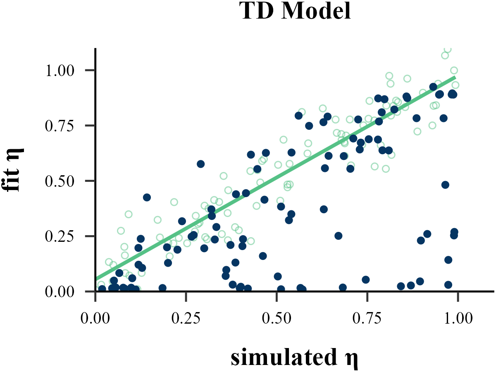
    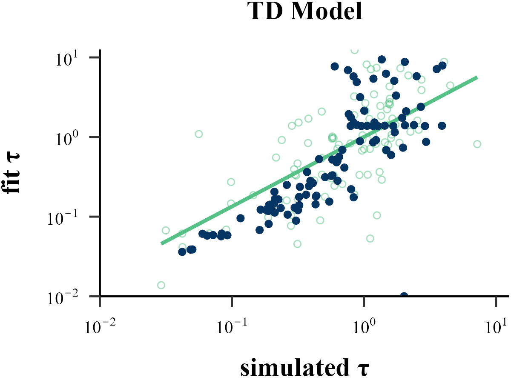
</p>

The value of the softmax parameter $\tau$ affects the recovery of other parameters in the model. Under the assumption that $\tau \sim \text{Exp}(1)$, adding 1 to all $\tau$ values improves the recovery of the learning rate  $\eta$, but decreases the recovery accuracy of  $\tau$ itself.


<p align="center">
    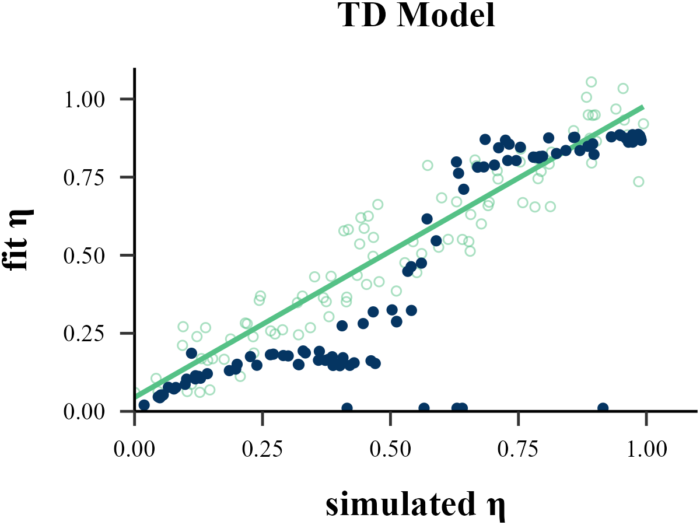
    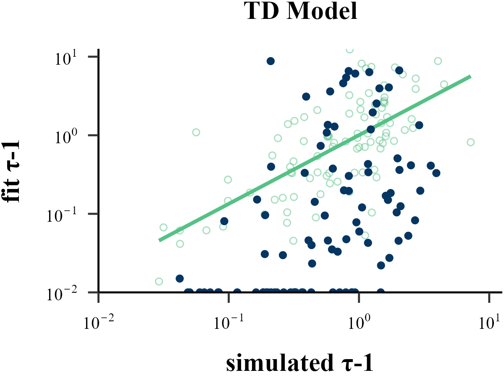
</p>

<!---------------------------------------------------------->

### Model Recovery

> "More specifically, model recovery involves simulating data from all models (with a range of parameter values carefully selected as in the case of parameter recovery) and then fitting that data with all models to determine the extent to which fake data generated from model A is best fit by model A as opposed to model B. This process can be summarized in a confusion matrix that quantifies the probability that each model is the best fit to data generated from the other models, that is, *p*(*fit model* = B | *simulated model* = A)."

<!---------------------------------------------------------->

<p align="center">
    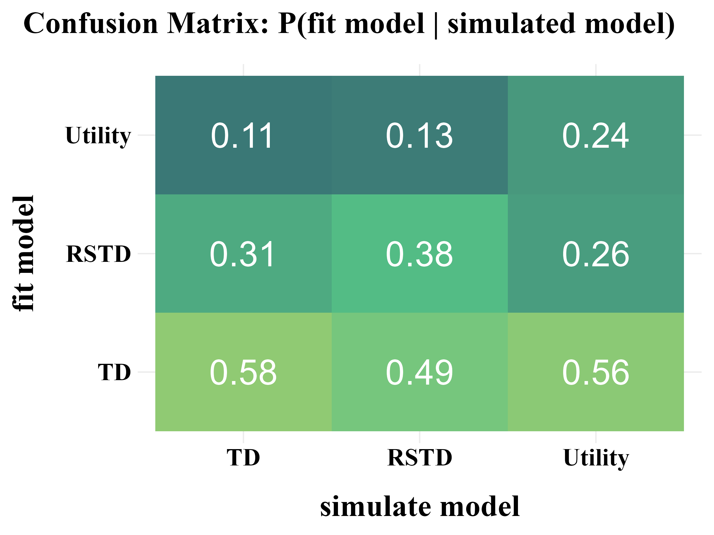
    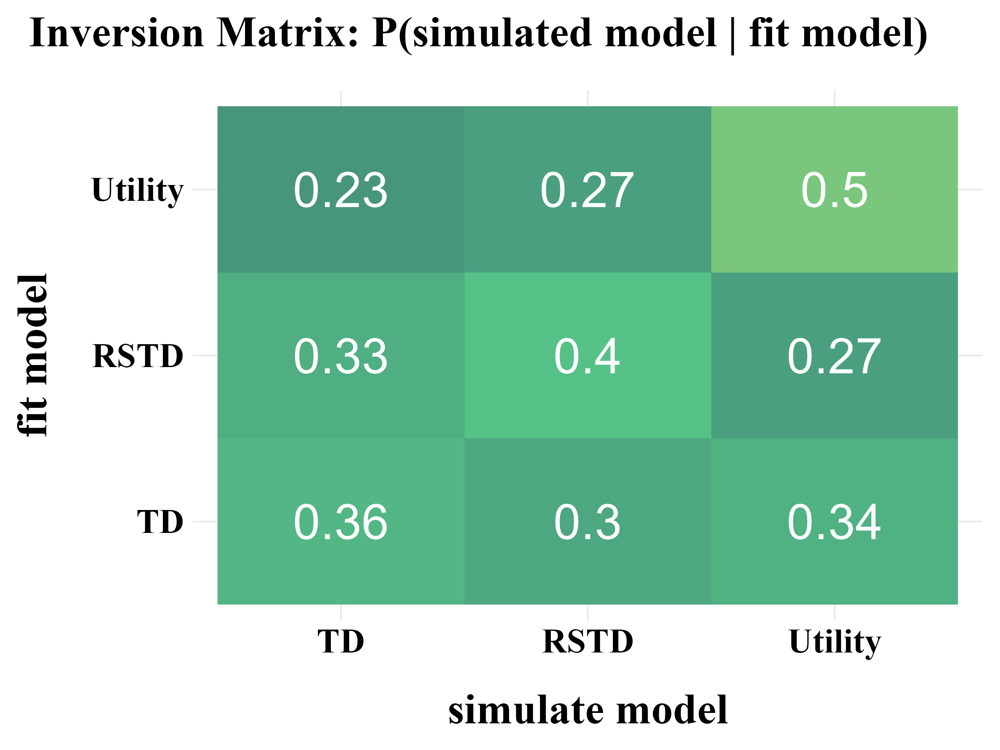
</p>

> "In panel B, all of the softmax parameters $b$ and $b_{c}$ were increased by 1. This has the effect of reducing the amount of noise in the behavior, which makes the models more easily identifiable and the corresponding confusion matrix more diagonal."

<p align="center">
    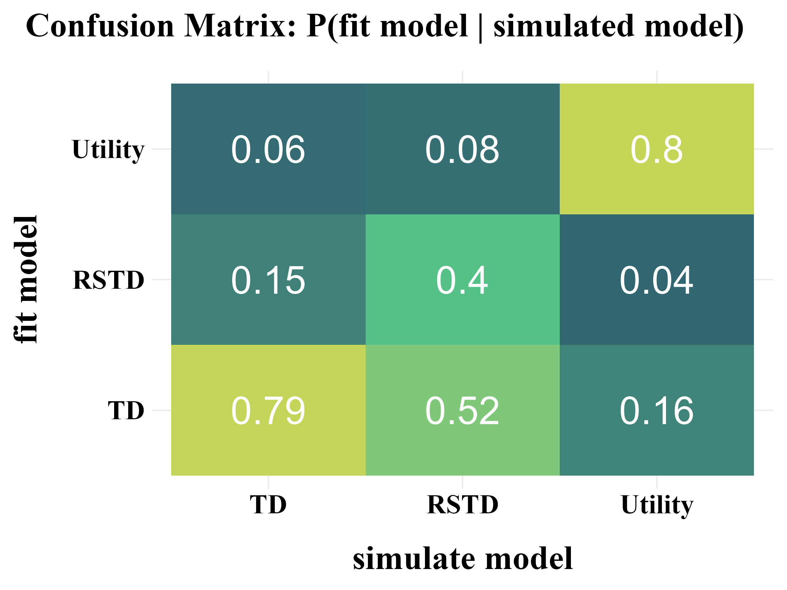
    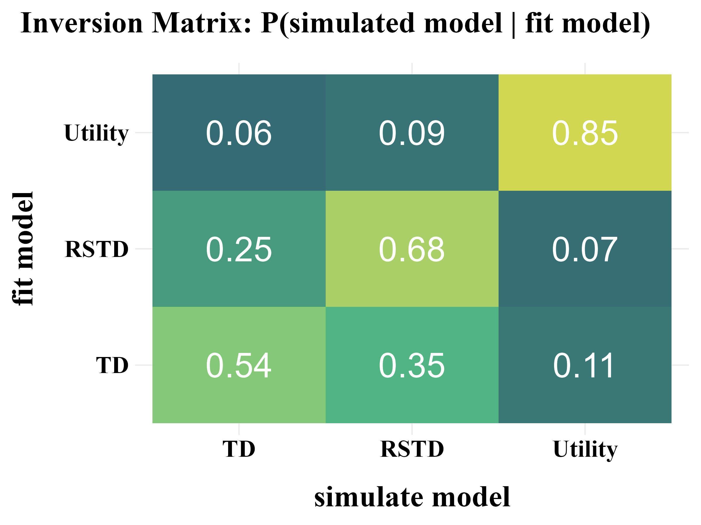
</p>

<!---------------------------------------------------------->

## 3. Fit Real Data {#3-fit-real-data}
Following the recommendations of Wilson & Collins [(2019)](https://doi.org/10.7554/eLife.49547), a model is only worth fitting to real data if it demonstrates good performance in the parameter recovery and model recovery.

> Once all the previous steps have been completed, you can finally move on to modeling your empirical data. 

> If the model-independent analyses do not show evidence of the expected results, there is almost no point in fitting the model. Instead, you should go back to the beginning, either re-thinking the computational models if the analyses show interesting patterns of behavior, or re-thinking the experimental design or even the scientific question you are trying to answer.

```{r eval=FALSE}
comparison <- binaryRL::fit_p(
  data = binaryRL::Mason_2024_G2,
  id = unique(binaryRL::Mason_2024_G2$Subject),
# ╔═══════════════════════════════════════════════════════════════════════════╗ #
# ║ --------------------------- black-box function -------------------------- ║ #
  #funcs = c("your_funcs"),
  policy = c("off", "on"),
  model_name = c("TD", "RSTD", "Utility"),
  fit_model = list(binaryRL::TD, binaryRL::RSTD, binaryRL::Utility),
# ║ ------------------------------- estimate -------------------------------- ║ #
  estimate = c("MLE", "MAP"),
# ║ ---------------------------------- MLE ---------------------------------- ║ #
  lower = list(c(0, 0), c(0, 0, 0), c(0, 0, 0)),
  upper = list(c(1, 10), c(1, 1, 10), c(1, 1, 10)),
# ║ ---------------------------------- MAP ---------------------------------- ║ #
  priors = list(
    list(
      eta = function(x) { stats::dunif(x, min = 0, max = 1, log = TRUE) }, 
      tau = function(x) { stats::dexp(x, rate = 1, log = TRUE) }
    ), 
    list(
      eta = function(x) { stats::dunif(x, min = 0, max = 1, log = TRUE) }, 
      eta = function(x) { stats::dunif(x, min = 0, max = 1, log = TRUE) }, 
      tau = function(x) { stats::dexp(x, rate = 1, log = TRUE) }
    ), 
    list(
      eta = function(x) { stats::dunif(x, min = 0, max = 1, log = TRUE) }, 
      gamma = function(x) { stats::dunif(x, min = 0, max = 1, log = TRUE) }, 
      tau = function(x) { stats::dexp(x, rate = 1, log = TRUE) }
    )
  ),
# ║ ---------------------------- iteration number --------------------------- ║ #
  iteration_i = 100,
  iteration_g = 100,
# ║ ------------------------------- algorithms ------------------------------ ║ #
  nc = 1,                  # <nc > 1>: parallel computation across subjects
  # Base R Optimization  
  #algorithm = "L-BFGS-B"   # Gradient-Based (stats)
# ║ ------------------------------------------------------------------------- ║ #
  # Specialized External Optimization
  #algorithm = "GenSA"     # Simulated Annealing (GenSA)
  #algorithm = "GA"        # Genetic Algorithm (GA)
  #algorithm = "DEoptim"   # Differential Evolution (DEoptim)
  #algorithm = "PSO"       # Particle Swarm Optimization (pso)
  #algorithm = "Bayesian"  # Bayesian Optimization (mlrMBO)
  #algorithm = "CMA-ES"    # Covariance Matrix Adapting (cmaes)
# ║ ------------------------------------------------------------------------- ║ #
  # Optimization Library (nloptr)
  algorithm = c("NLOPT_GN_MLSL", "NLOPT_LN_BOBYQA")
# ║ ------------------------------- algorithms ------------------------------ ║ #
# ╚═══════════════════════════════════════════════════════════════════════════╝ # 
)

result <- dplyr::bind_rows(comparison)

write.csv(result, "../OUTPUT/result_comparison.csv", row.names = FALSE)
```  

<pre>
Fitting Model: TD

  |================                                                           | 25%
</pre>

Check the Example Result: [result_comparison.csv](./demo/OUTPUT/result_comparison.html)

<!---------------------------------------------------------->

### Model Comparison

Using the result file generated by `binaryRL::fit_p`, you can compare models and select the best one.

<!---------------------------------------------------------->
#### Visualizing Model Comparison

<p align="center">
    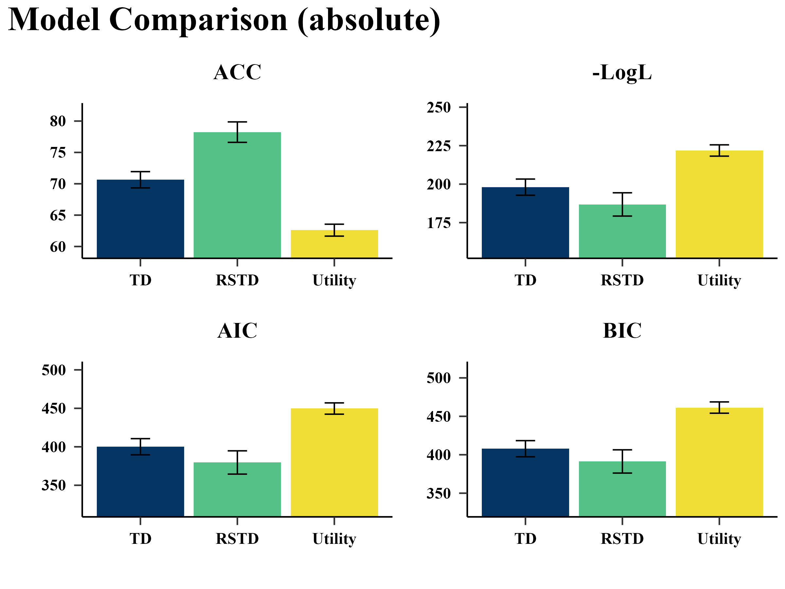
    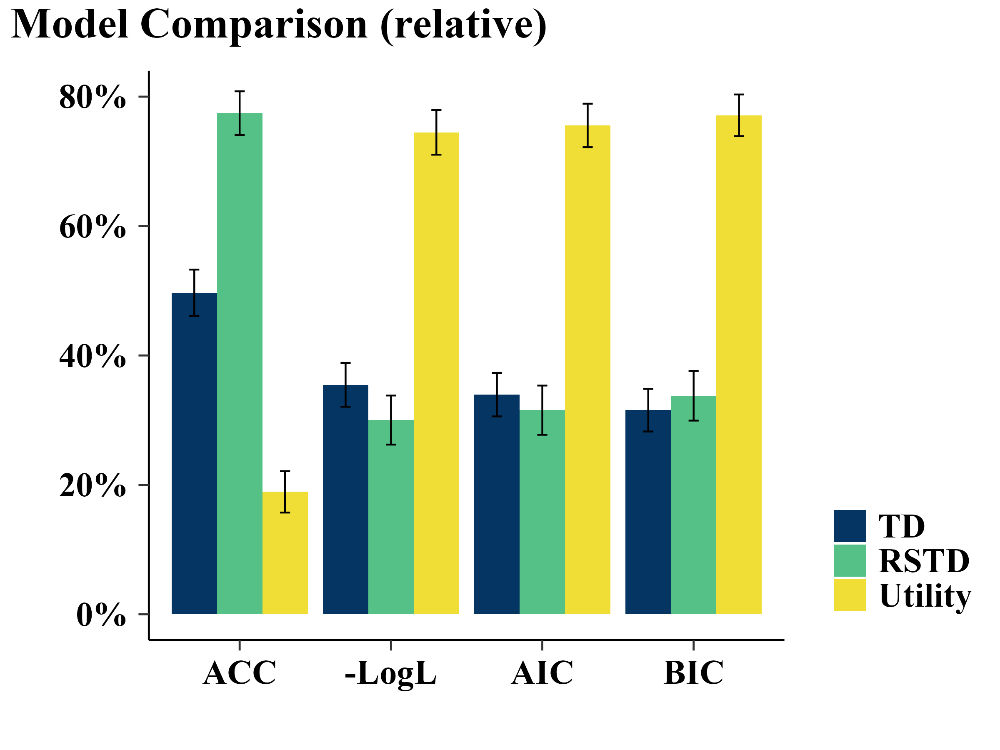
</p>


<!---------------------------------------------------------->

## 4. Replay the Experiment {#4-replay-the-experiment}
Users can use the simple code snippet below to load the model fitting results, retrieve the best-fitting parameters, and feed them back into the model to reproduce the behavioral data generated by each reinforcement learning model.

```{r eval=FALSE}
list <- list()

list[[1]] <- dplyr::bind_rows(
  binaryRL::rpl_e(
    data = binaryRL::Mason_2024_G2,
    result = read.csv("../OUTPUT/result_comparison.csv"), 
    model = binaryRL::TD,
    model_name = "TD", 
    param_prefix = "param_",
  )
)

list[[2]] <- dplyr::bind_rows(
  binaryRL::rpl_e(
    data = binaryRL::Mason_2024_G2,
    result = read.csv("../OUTPUT/result_comparison.csv"), 
    model = binaryRL::RSTD,
    model_name = "RSTD", 
    param_prefix = "param_",
  )
)

list[[3]] <- dplyr::bind_rows(
  binaryRL::rpl_e(
    data = binaryRL::Mason_2024_G2,
    result = read.csv("../OUTPUT/result_comparison.csv"), 
    model = binaryRL::Utility,
    param_prefix = "param_",
    model_name = "Utility", 
  )
)
```

<!---------------------------------------------------------->

### Visualizing Experimental Effect

<p align="center">
    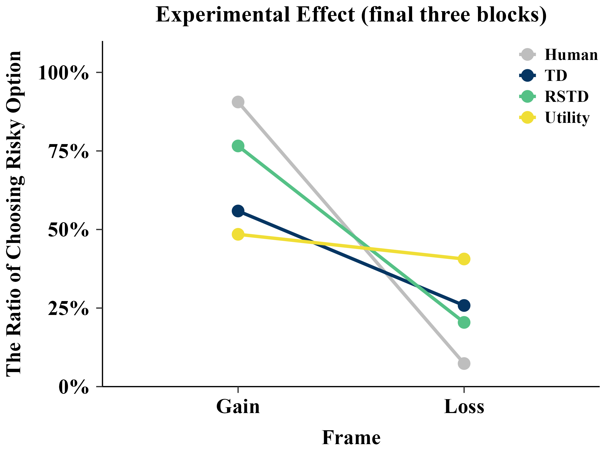
    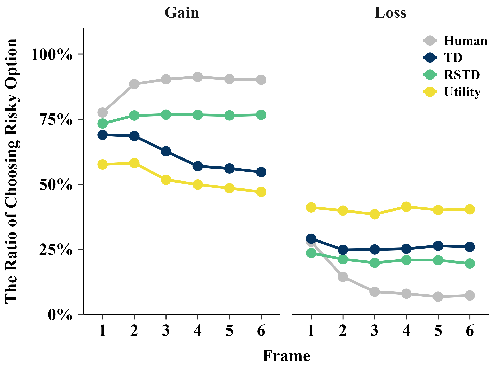
</p>

<!---------------------------------------------------------->
