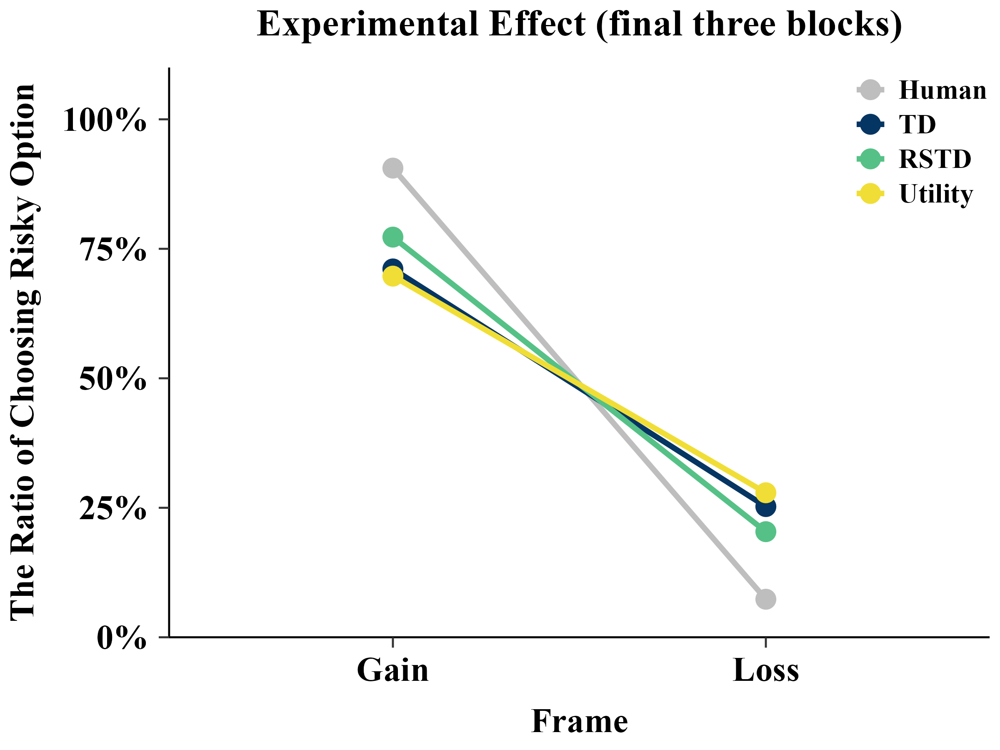
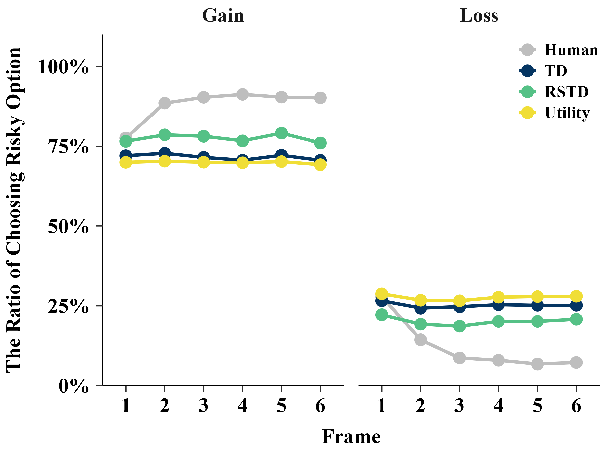
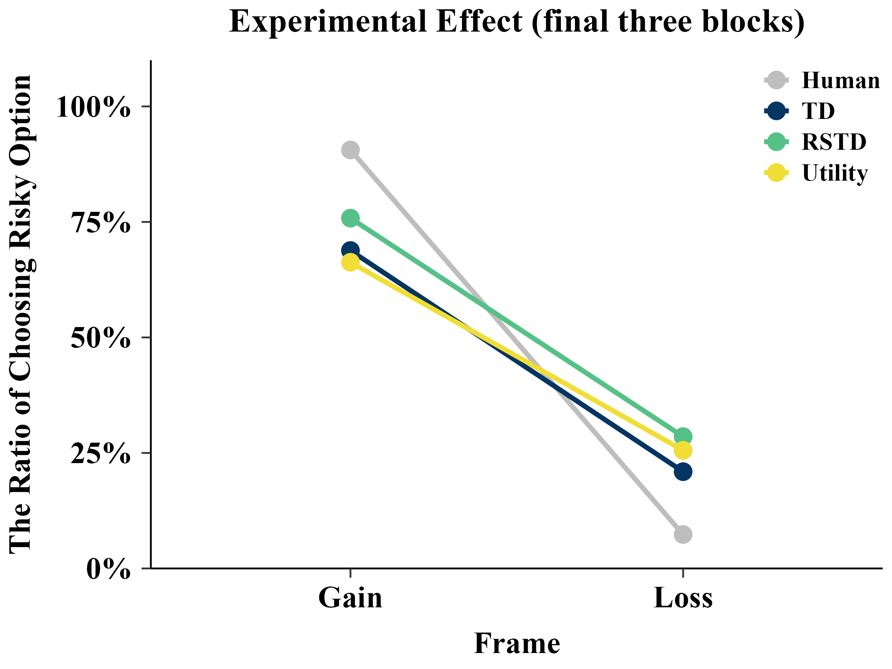
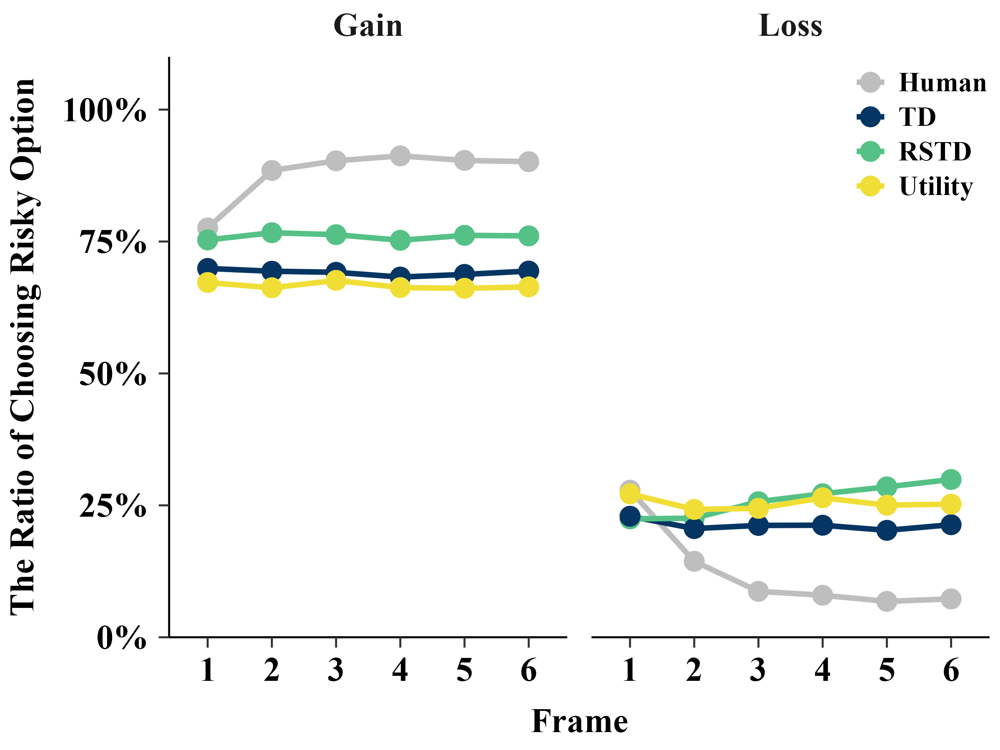

<p align="center">
    
</p>

# On-Policy

## Replay the Experiment
```{r eval=FALSE}
list <- list()
```

### TD
```{r eval=FALSE}
list[[1]] <- dplyr::bind_rows(
  binaryRL::rpl_e(
    data = binaryRL::Mason_2024_G2,
    result = read.csv("../OUTPUT/result_comparison_on.csv"), 
    model = binaryRL::TD,
    model_name = "TD"
  )
)
```

### RSTD
```{r eval=FALSE}
list[[2]] <- dplyr::bind_rows(
  binaryRL::rpl_e(
    data = binaryRL::Mason_2024_G2,
    result = read.csv("../OUTPUT/result_comparison_on.csv"), 
    model = binaryRL::RSTD,
    model_name = "RSTD"
  )
)
```

### Utility
```{r eval=FALSE}
list[[3]] <- dplyr::bind_rows(
  binaryRL::rpl_e(
    data = binaryRL::Mason_2024_G2,
    result = read.csv("../OUTPUT/result_comparison_on.csv"), 
    model = binaryRL::Utility,
    model_name = "Utility"
  )
)
```

## Plot
### Frame

<details>
<summary>Plot Code</summary>
```{r eval=FALSE}
plot <- list()

model_name <- c("TD", "RSTD", "Utility")

for(i in 1:3){
  plot[[i]] <- list[[i]]%>%
    dplyr::filter(Frame %in% c("Gain","Loss")) %>%
    dplyr::filter(Block %in% c(4, 5, 6)) %>%
    dplyr::select(Subject, Frame, Rob_Choose) %>%
    dplyr::mutate(
      Model = model_name[i],
      Subject = factor(Subject),
      Rob_Choose = case_when(
        Rob_Choose %in% c("A", "C") ~ 0,
        Rob_Choose %in% c("B", "D") ~ 1,
    ),
    ) %>%
    dplyr::group_by(Model, Subject, Frame) %>%
    dplyr::summarise(Rate = mean(Rob_Choose)) %>%
    dplyr::ungroup() %>%
    dplyr::arrange(Subject, Frame)
}

plot[[4]] <- binaryRL::Mason_2024_G2%>%
    dplyr::filter(Frame %in% c("Gain","Loss")) %>%
    dplyr::filter(Block %in% c(4, 5, 6)) %>%
    dplyr::select(Subject, Frame, Sub_Choose) %>%
    dplyr::mutate(
      Model = "Human",
      Subject = factor(Subject),
      Sub_Choose = case_when(
        Sub_Choose %in% c("A", "C") ~ 0,
        Sub_Choose %in% c("B", "D") ~ 1,
    ),
    ) %>%
    dplyr::group_by(Model, Subject, Frame) %>%
    dplyr::summarise(Rate = mean(Sub_Choose)) %>%
    dplyr::ungroup() %>%
    dplyr::arrange(Subject, Frame)

plot <- dplyr::bind_rows(plot) %>%
  dplyr::group_by(Model, Frame) %>%
  dplyr::summarise(
    mean_Rate = mean(Rate),
    se_Rate = sd(Rate) / sqrt(n_distinct(Subject) - 1),
  ) %>%
  dplyr::ungroup() %>%
  dplyr::mutate(
    Model = factor(Model, levels = c("Human", "TD", "RSTD", "Utility"))
  )

rm(i, model_name)

p <- ggplot2::ggplot(
  data = plot, 
  ggplot2::aes(
    x = factor(Frame), y = mean_Rate, color = Model, group = Model)
  ) +
  ggplot2::geom_line(linewidth = 1.5) +
  ggplot2::geom_point(size = 5) +
  ggplot2::scale_color_manual(
    values = c("grey", "#053562", "#55c186", "#f0de36")
  ) +
  ggplot2::scale_y_continuous(
    limits = c(0, 1.1),
    breaks = c(0, 0.25, 0.5, 0.75, 1), 
    labels = c("0%", "25%", "50%", "75%", "100%"),
    expand = c(0, 0)
  ) +
  ggplot2::labs(
    x = "Frame", 
    y = "The Ratio of Choosing Risky Option",
    title = "Experimental Effect (final three blocks)"
  ) +
  papaja::theme_apa() +
  ggplot2::theme(
    legend.position = c(0.8, 0.7),  
    legend.justification = c(0, 0), 
    legend.title = element_blank(),
    text = element_text(
      family = "serif", 
      face = "bold",
      size = 20
    ),
    axis.text = element_text(
      color = "black",
      family = "serif", 
      face = "bold",
      size = 20
    )
  )

ggplot2::ggsave(
  plot = p, 
  filename = "../FIGURE/Exp_Effect(Frame).png",
  width = 8,
  height = 6
)

plot
p

rm(plot, p)
```
</details>

<p align="center">
    
</p>

### Block

<details>
<summary>Plot Code</summary>
```{r eval=FALSE}
plot <- list()

model_name <- c("TD", "RSTD", "Utility")

for(i in 1:3){
  plot[[i]] <- list[[i]] %>%
    dplyr::filter(Frame %in% c("Gain","Loss")) %>%
    dplyr::select(Subject, Frame, Block, Rob_Choose) %>%
    dplyr::mutate(
      Model = model_name[i],
      Subject = factor(Subject),
      Rob_Choose = case_when(
        Rob_Choose %in% c("A", "C") ~ 0,
        Rob_Choose %in% c("B", "D") ~ 1,
    ),
    ) %>%
    dplyr::group_by(Model, Subject, Block, Frame) %>%
    dplyr::summarise(Rate = mean(Rob_Choose)) %>%
    dplyr::ungroup() %>%
    dplyr::arrange(Subject, Frame)
}

plot[[4]] <- binaryRL::Mason_2024_G2 %>%
    dplyr::filter(Frame %in% c("Gain","Loss")) %>%
    dplyr::select(Subject, Frame, Block, Sub_Choose) %>%
    dplyr::mutate(
      Model = "Human",
      Subject = factor(Subject),
      Sub_Choose = case_when(
        Sub_Choose %in% c("A", "C") ~ 0,
        Sub_Choose %in% c("B", "D") ~ 1,
    ),
    ) %>%
    dplyr::group_by(Model, Subject, Block, Frame) %>%
    dplyr::summarise(Rate = mean(Sub_Choose)) %>%
    dplyr::ungroup() %>%
    dplyr::arrange(Subject, Frame)

plot <- dplyr::bind_rows(plot) %>%
  dplyr::group_by(Model, Frame, Block) %>%
  dplyr::summarise(
    mean_Rate = mean(Rate),
    se_Rate = sd(Rate) / sqrt(n_distinct(Subject) - 1),
  ) %>%
  dplyr::ungroup() %>%
  dplyr::mutate(
    Model = factor(Model, levels = c("Human", "TD", "RSTD", "Utility"))
  )

rm(i, model_name)

p <- ggplot2::ggplot(
  data = plot, 
  ggplot2::aes(
    x = Block, y = mean_Rate, color = Model, group = Model)
  ) +
  ggplot2::geom_line(linewidth = 1.5) +
  ggplot2::geom_point(size = 5) +
  ggplot2::scale_color_manual(
    values = c("grey", "#053562", "#55c186", "#f0de36")
  ) +
  ggplot2::scale_y_continuous(
    limits = c(0, 1.1),
    breaks = c(0, 0.25, 0.5, 0.75, 1), 
    labels = c("0%", "25%", "50%", "75%", "100%"),
    expand = c(0, 0)
  ) +
  ggplot2::labs(x = "Frame", y = "The Ratio of Choosing Risky Option") +
  ggplot2::facet_wrap(~ Frame, ncol = 2) +
  papaja::theme_apa() +
  ggplot2::theme(
    legend.position = c(0.8, 0.7),  
    legend.justification = c(0, 0), 
    legend.title = element_blank(),
    text = element_text(
      family = "serif", 
      face = "bold",
      size = 20
    ),
    axis.text = element_text(
      color = "black",
      family = "serif", 
      face = "bold",
      size = 20
    )
  )

ggplot2::ggsave(
  plot = p, 
  filename = "../FIGURE/Exp_Effect(Block).png",
  width = 8,
  height = 6
)

plot
p

rm(plot, p)
```
</details>

<p align="center">
    
</p>

# Off-Policy

## Replay the Experiment
```{r eval=FALSE}
list <- list()
```

### TD
```{r eval=FALSE}
list[[1]] <- dplyr::bind_rows(
  binaryRL::rpl_e(
    data = binaryRL::Mason_2024_G2,
    result = read.csv("../OUTPUT/result_comparison_off.csv"), 
    model = binaryRL::TD,
    model_name = "TD"
  )
)
```

### RSTD
```{r eval=FALSE}
list[[2]] <- dplyr::bind_rows(
  binaryRL::rpl_e(
    data = binaryRL::Mason_2024_G2,
    result = read.csv("../OUTPUT/result_comparison_off.csv"), 
    model = binaryRL::RSTD,
    model_name = "RSTD"
  )
)
```

### Utility
```{r eval=FALSE}
list[[3]] <- dplyr::bind_rows(
  binaryRL::rpl_e(
    data = binaryRL::Mason_2024_G2,
    result = read.csv("../OUTPUT/result_comparison_off.csv"), 
    model = binaryRL::Utility,
    model_name = "Utility"
  )
)
```

## Plot
### Frame

<p align="center">
    
</p>

### Block

<p align="center">
    
</p>