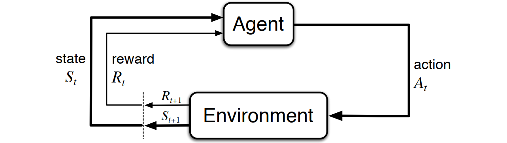

$$
\textbf{Markov Decision Process (MDP)} 
$$

    

$$
\Downarrow 
$$

$$
\textbf{Temporal-Difference TD(λ)} 
$$

$$
V_{\text{new}}(S_t) \leftarrow V_{\text{old}}(S_t) + \eta \cdot \left[ 
G_t^{\lambda} - V_{\text{old}}(S_t) 
\right] 
$$
$$
G_t^{\lambda} = (1-\lambda)\sum_{n=1}^{T-t-1}\lambda^{n-1}G_{t:t+n} + \lambda^{T-t-1}G_t
$$

$$
\Downarrow 
$$

$$
G_t^{\lambda} \xrightarrow{\lambda = 0} 
G_t^{0} = (1-0)\sum_{n=1}^{T-t-1}0^{n-1}G_{t:t+n} + 0^{T-t-1}G_t
$$

$$
\Downarrow 
$$

$$
G_t^{0} = G_{t:t+1}= r_{t+1} + \gamma V_{\text{old}}(S_{t+1})
$$

$$
\Downarrow 
$$

$$
\textbf{Temporal-Difference TD(0)}
$$

$$
V_{\text{new}}(S_t) \leftarrow V_{\text{old}}(S_t) + \eta \cdot \left[ 
r_{t+1} + \gamma V_{\text{old}}(S_{t+1}) - V_{\text{old}}(S_t) 
\right] 
$$
$$
\Downarrow
$$

$$
r_{t+1} + \gamma V_{\text{old}}(S_{t+1})
\quad
\xrightarrow{\gamma = 0}
\quad
r_{t+1}
$$

$$
\Downarrow
$$

$$
\textbf{Rescorla-Wagner Model}
$$

$$
V_{\text{new}}(S_t) \leftarrow V_{\text{old}}(S_t) + \eta \cdot \left[r_{t+1} - V_{\text{old}}(S_t) \right]
$$

<!---------------------------------------------------------->

## **Utility Function (γ)**  

People's subjective perception of objective rewards is more accurate. This is because the relationship between physical quantities and psychological quantities is not necessarily always a linear discount function; it could also be another type of power function relationship (Stevens' Power Law).  

$$  
U(r) = r^{\gamma}  
$$  

According to **Kahneman's Prospect Theory**, individuals exhibit distinct utility functions for **gains** and **losses**. Referencing Nilsson et al. [(2012)](https://doi.org/10.1016/j.jmp.2010.08.006), we have implemented the model below. By replacing `util_func` with the specified form that follows, you can enable the model to run a utility function based on **Kahneman's Prospect Theory**.

$$
U(R) = 
\begin{cases}
  -\beta \cdot (-R)^{\gamma_{1}}, & \text{if } x \le 0 
  \\
  R^{\gamma_{2}}, & \text{if } x > 0 
\end{cases}
$$

*NOTE:* Although both traditional reinforcement learning and my model utilize the symbol $\gamma$, its interpretation differs. In traditional RL, $\gamma$ serves as the discount rate for future rewards. In contrast, within this package, $\gamma$ functions as a parameter in the utility function.

<!---------------------------------------------------------->

## **Learning Rates (η)**  

This parameter $\eta$ controls how quickly an agent updates its value estimates based on new information. The closer the learning rate is to 1, the more aggressively the value is updated, giving greater credence to the immediate reward rather than previously learned value.

$$
\eta(p) =
\begin{cases} 
  \eta, &  |\mathbf{p}| = 1 \quad \text{(TD)} 
  \\
  \eta_{-}; \eta_{+}, &  |\mathbf{p}| = 2 \quad \text{(RDTD)}
\end{cases}
$$

*NOTE:* When there's only one $\eta$ parameter, it corresponds to the TD model. If there are two $\eta$ parameters, it refers to the RSTD model.

<!---------------------------------------------------------->

## **Exploration Strategy (ε)**  

The parameter $\epsilon$ represents the probability of participants engaging in exploration (random choosing). In addition A threshold ensures participants always explore during the initial trials, after which the likelihood of exploration is determined by $\epsilon$..   

### ε-first
$$
P(x) =
\begin{cases} 
  trial \le threshold, &  x = 1 \quad \text{(random choosing)} 
  \\
  trial > threshold, &  x = 0 \quad \text{(value-based choosing)}
\end{cases}
$$

### ε-greedy

$$
P(x) =
\begin{cases} 
  \epsilon, &  x = 1 \quad \text{(random choosing)} 
  \\
  1 - \epsilon, &  x = 0 \quad \text{(value-based choosing)}
\end{cases}
$$

### ε-decreasing

$$
P(x) =
\begin{cases} 
  \frac{1}{1 + \lambda i}, &  x = 1 \quad \text{(random choosing)} 
  \\
  \frac{\lambda i}{1 + \lambda i}, &  x = 0 \quad \text{(value-based choosing)}
\end{cases}
$$

<!---------------------------------------------------------->
## **Upper-Confidence-Bound (π)**  

Parameter used in the Upper-Confidence-Bound (UCB) action selection formula. it controls the degree of exploration by scaling the uncertainty bonus given to less-explored options.

$$
A_t = \arg \max_{a} \left[ V_t(a) + \pi \sqrt{\frac{\ln(t)}{N_t(a)}} \right]
$$

<!---------------------------------------------------------->

## **Soft-Max (τ)**  

The parameter $\tau$ represents people's sensitivity to value differences. The larger $\tau$, the more sensitive they are to the differences in value between the two options.

$$
P_{L} = \frac{1}{1 + e^{-(V_{L} - V_{R}) \cdot \tau}}
\quad \quad
P_{R} = \frac{1}{1 + e^{-(V_{R} - V_{L}) \cdot \tau}}
$$
<!---------------------------------------------------------->

## **Loss Function (LL)**  

Loss Function express the resemblance between human behavior and model predictions. 

$$
LL = \sum B_{L} \times \log P_{L} + \sum B_{R} \times \log P_{R}
$$

